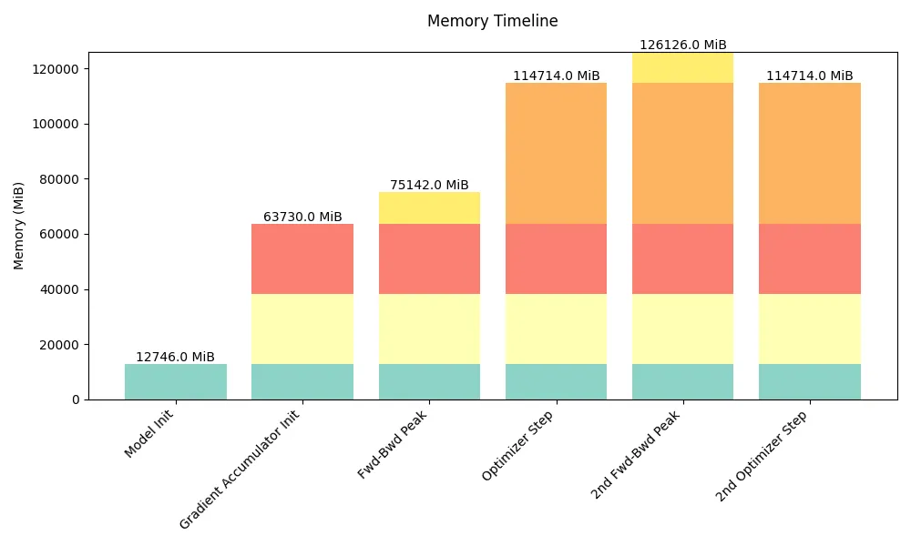

# 導論與全書鳥瞰（Introduction & High-Level Overview）

> 譯自 Hugging Face nanotron 團隊《The Ultra-Scale Playbook: Training LLMs on GPU Clusters》（Nouamane Tazi 等著，Apache 2.0），原文為 [Hugging Face Space](https://huggingface.co/spaces/nanotron/ultrascale-playbook)。

**《The Ultra-Scale Playbook: Training LLMs on GPU Clusters》**（超大規模訓練手冊：在 GPU 叢集上訓練大型語言模型）

> 🔬 原文此處為互動圖表（書名頁橫幅）：我們在最多 512 顆 GPU 上執行了超過 4,000 次規模化實驗，並量測吞吐量（throughput，以標記大小表示）與 GPU 使用率（以標記顏色表示）；注意在此視覺化中，兩者皆已依模型大小正規化。可至[原網頁](https://huggingface.co/spaces/nanotron/ultrascale-playbook)體驗。

數千顆 GPU 完美和諧地運轉著——這就是訓練當今最強大 AI 模型所需要的景象：一場運算能力的交響樂，而直到不久之前，這場演出仍是菁英研究實驗室的專屬領域。開源已經改變了這個局面，但並未徹底改變。沒錯，你可以下載最新的 [Llama](https://huggingface.co/meta-llama) 或 [DeepSeek](https://huggingface.co/deepseek-ai) 模型；沒錯，你也可以閱讀它們的[技術報告](https://ai.meta.com/research/publications/the-llama-3-herd-of-models/)與[實驗報告](https://github.com/deepseek-ai/DeepSeek-R1/blob/main/DeepSeek_R1.pdf)。但最具挑戰性的部分——訓練程式碼，以及協調 GPU 訓練這些龐大系統所需的知識與技術——仍然籠罩在複雜性之中，散落於一系列彼此脫節的論文與往往不公開的程式碼庫裡。

> 閱讀時間：2–4 天。為獲得最佳閱讀體驗，建議不要使用手機閱讀。

這本開源書籍就是要改變這一切。我們將從基礎開始，一步步帶你掌握把大型語言模型（Large Language Model, LLM）的訓練從單顆 GPU 擴展到數十、數百甚至數千顆 GPU 所需的知識，並以實用的程式碼範例與可重現的基準測試（benchmark）來佐證理論。

隨著訓練這些模型所用的叢集規模不斷成長，人們發明了各式各樣的技術——例如資料平行（Data Parallelism, DP）、張量平行（Tensor Parallelism, TP）、管線平行（Pipeline Parallelism, PP）與上下文平行（Context Parallelism, CP），以及 ZeRO 與核心融合（kernel fusion）——來確保 GPU 隨時維持高使用率。這不僅大幅縮短了訓練時間，也讓這些昂貴的硬體發揮最大效益。更進一步地說，擴展 AI 訓練的挑戰不僅止於打造最初的模型；各團隊也發現，在特定領域資料上微調（fine-tuning）大型模型往往能得到最佳成果，而這通常也會用到相同的分散式訓練技術。在本書中，我們會循序漸進地介紹所有這些技術——從最簡單的到最精巧的——同時維持單一敘事主軸，讓你理解每種方法的來龍去脈。

> 如果你有任何問題或意見，歡迎到[社群討論區（Community tab）](https://huggingface.co/spaces/nanotron/ultrascale-playbook/discussions?status=open&type=discussion)開一個討論串！

我們假設你對當前的 LLM 架構已有一些基本認識，也大致熟悉深度學習模型的訓練方式，但對分散式訓練可以是全然的新手。如有需要，模型訓練的基礎知識可以在 [DeepLearning.ai](https://www.deeplearning.ai) 的優質課程或 [PyTorch 教學單元](https://pytorch.org/tutorials/beginner/basics/intro.html)中找到。本書可視為三部曲的第二部，接續我們第一篇探討預訓練資料處理的部落格文章，也就是所謂的「[FineWeb 部落格文章](https://huggingface.co/spaces/HuggingFaceFW/blogpost-fineweb-v1)」。讀完這兩篇之後，你幾乎就掌握了理解當今高效能 LLM 如何打造的所有核心知識，只差資料混配（data mixing）與架構選擇這幾味最後的香料，就能湊齊完整的配方（敬請期待第三部……）。

> 我們由衷感謝整個 [distill.pub](https://distill.pub/) 團隊打造了本文所依據的版面模板。

本書建立在以下**三大基礎**之上：

**理論與概念的快速導覽：** 在深入程式碼與實驗之前，我們希望先從高層次理解每種方法的運作原理，以及各自的優勢與限制。你會學到語言模型的哪些部分會吃掉你的記憶體，以及這在訓練過程中的哪個時間點發生。你也會學到我們如何透過把模型平行化來解決記憶體限制，並透過擴增 GPU 數量來提高吞吐量。讀完之後，你就能理解下面這個用來計算 Transformer 模型記憶體用量分解（memory breakdown）的互動元件（widget）是如何運作的：

> 📝 **註**：這個互動元件目前還缺少管線平行的部分，就當作留給讀者的練習吧。

> 🔬 原文此處為互動圖表（「Memory usage breakdown」記憶體用量分解元件）：可調整注意力頭數（a）、隱藏維度（h）、前饋維度（h_ff）、層數（L）、序列長度（s）、詞彙表大小（v）、微批次大小（b）、混合精度、重算策略（None／Selective／Full）、ZeRO 階段（0／1／2／3）、前饋激活函數（ReLU／GELU／SwiGLU）、序列平行、張量平行（t）、資料平行（d）、優化器參數（k）等設定，也可套用 Llama 3 Tiny／8B／70B／405B 等預設值，即時觀察模型的記憶體用量分解。可至[原網頁](https://huggingface.co/spaces/nanotron/ultrascale-playbook)體驗。

（如果你完全看不懂這個互動元件在做什麼，別擔心——這正是我們寫這本書的原因。）

雖然這個互動元件提供的是理論上的分解，我們也另外製作了[這個工具](https://huggingface.co/spaces/nanotron/predict_memory)，可用來預測實際訓練過程中的記憶體用量：

**清楚的程式碼實作：** 理論是一回事，但當我們實際動手實作時，才會發現各式各樣的邊角案例（edge case）與重要細節。因此我們會盡可能附上實作參考連結。視情況而定，我們會使用兩套參考程式碼：

* [picotron](https://github.com/huggingface/picotron) 程式碼庫是為教學而打造，因此通常會把每個概念實作在單一、自成一體的短檔案中。

* 另一方面，若要參考生產環境等級（production-ready）的程式碼，我們會引用 [nanotron](https://github.com/huggingface/nanotron) 的實作——這是 Hugging Face 實際使用的生產級訓練程式碼庫。

> 如果比起閱讀本書或 picotron 的程式碼，你更想透過影片學習分散式訓練，可以看看 [Ferdinand 的 YouTube 頻道](https://www.youtube.com/watch?v=u2VSwDDpaBM&list=PL-_armZiJvAnhcRr6yTJ0__f3Oi-LLi9S)。

**真實的訓練效率基準測試：** 最後，如何*實際*擴展你的 LLM 訓練規模，取決於你的基礎設施——例如晶片種類、互連（interconnect）等——因此我們無法給出一體適用的單一配方。我們能給你的，是一套對多種配置進行基準測試的方法，而這正是我們在自己的叢集上所做的事！我們執行了超過 4,100 次分散式實驗（若計入測試執行則超過 16,000 次），最多動用 512 顆 GPU，掃描了許多可能的分散式訓練布局與模型大小。

> 🔬 原文此處為互動圖表（基準測試結果瀏覽器）：可互動探索上述 4,100 多次分散式實驗在各種訓練布局與模型大小下的結果，可至[原網頁](https://huggingface.co/spaces/nanotron/ultrascale-playbook)體驗。

如你所見，本書要涵蓋的內容相當廣泛。在進入分散式訓練的壕溝之前，讓我們先快速地從高處鳥瞰一下本書將要面對的各項挑戰。

## 高層次總覽（High-Level Overview）

本書涵蓋的所有技術，都是在解決以下三大關鍵挑戰中的一項或多項；這些挑戰也會在全書中反覆出現：

1. **記憶體用量（memory usage）**：這是一項硬性限制——如果一個訓練步驟（training step）連記憶體都放不下，訓練就無法進行。
2. **運算效率（compute efficiency）**：我們希望硬體把大部分時間花在運算上，因此必須減少花在資料傳輸、或等待其他 GPU 完成工作的時間。
3. **通訊負擔（communication overhead）**：我們希望把通訊負擔降到最低，因為它會讓 GPU 閒置。為此，我們會設法善用節點內（intra-node，較快）與節點間（inter-node，較慢）的頻寬，並盡可能讓通訊與運算重疊（overlap）。

在許多地方我們會看到，這三者（運算、通訊、記憶體）之間可以互相取捨——例如透過重算（recomputation）或張量平行。找到正確的平衡點，正是擴展訓練規模的關鍵。

由於本書內容非常龐大，我們製作了一份[速查表（cheatsheet）](../webapp/assets/images/ultra-cheatsheet.svg)，幫助你導覽全書並掌握整體重點。在這片驚濤駭浪中航行時，請把它貼身帶著！

