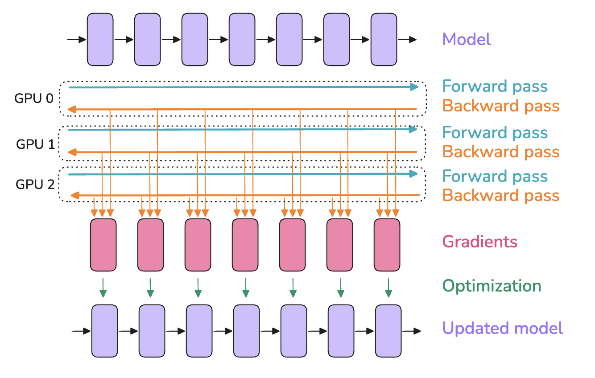
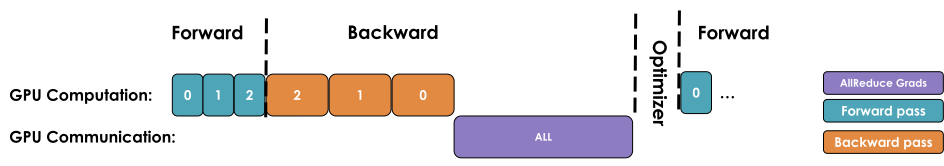
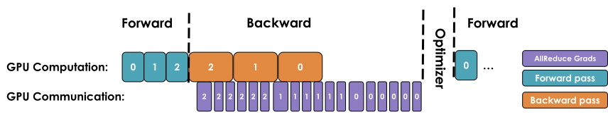
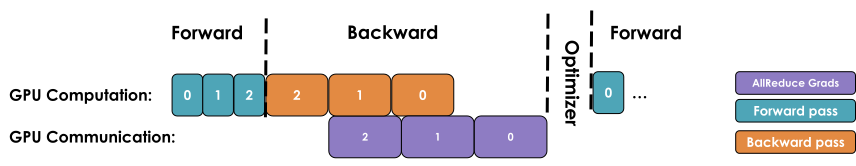
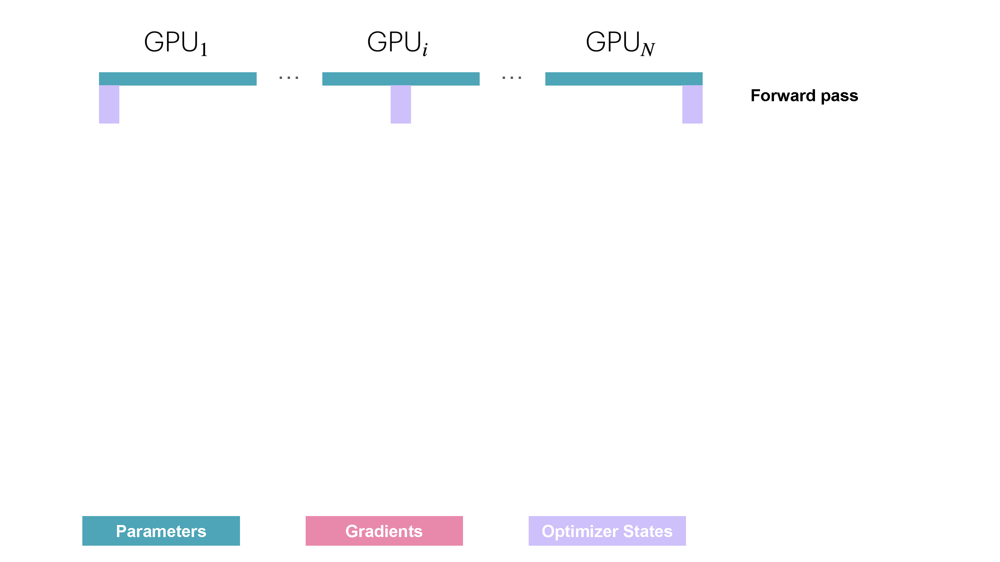
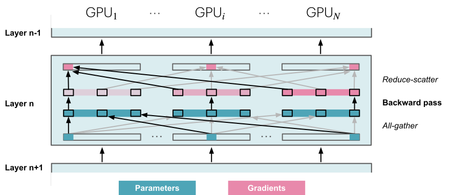
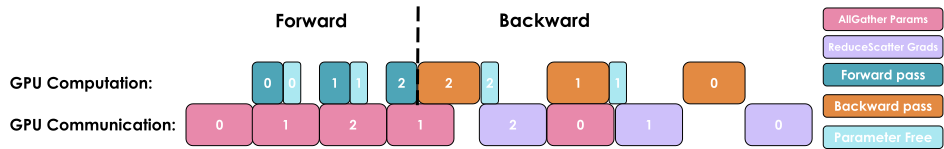

# 第 2 章　資料平行（Data Parallelism）

> 譯自 Hugging Face nanotron 團隊《The Ultra-Scale Playbook: Training LLMs on GPU Clusters》（Apache 2.0），原文為 [Hugging Face Space](https://huggingface.co/spaces/nanotron/ultrascale-playbook)。

> 🎧 原文此處嵌入一段由 NotebookLM 主持人討論本節內容的 Podcast 音訊，為閱讀增添廣播節目氛圍，可至[原網頁](https://huggingface.co/spaces/nanotron/ultrascale-playbook)聆聽。

資料平行（data parallelism, DP）背後的想法，是將模型複製到多顆 GPU 上（我們把這些副本稱為「模型實例」（model instances）），並在每顆 GPU 上以不同的資料微批次（micro-batch）平行執行前向與反向傳播——這正是「資料平行」名稱的由來。你或許已經在簡單的訓練範例中見過資料平行，但我們在本節會鑽研得更深，所以即使你已熟悉大致作法，也請繼續看下去。



> 如果你還不熟悉 broadcast、gather、all-reduce 這類分散式通訊模式，我們在〈A0：平行程式設計速成班〉中準備了一堂小小的速成課。

由於每顆 GPU 使用不同的微批次，各 GPU 上算出的梯度也會不同。為了讓不同 GPU 上的模型實例保持同步，我們會用一種稱為「all-reduce」的操作將各模型實例的梯度取平均；這個操作發生在反向傳播期間、優化器步驟之前。

這裡出現了我們的第一個「分散式通訊」原語（primitive）：**all-reduce**，它負責 GPU 實例與節點之間的同步與通訊。



一個樸素的 DP 實作會先等反向傳播完全結束、拿到所有梯度後，才對所有 DP rank 觸發一次 all-reduce 來同步梯度。但這種「先計算、後通訊」的循序步驟是**大忌**！因為我們不希望 GPU 在通訊進行時閒置，就像上圖那樣。

相反地，我們應該盡可能讓通訊與計算重疊（overlap），讓兩者盡量同時進行。

接下來我們來看三項優化，它們能讓我們做得比樸素的第一版實作好得多！

### 第一項優化：讓梯度同步與反向傳播重疊

我們剛才描述的樸素 DDP 作法，主要缺點在於反向傳播（*計算*）結束之後，必須先等待梯度同步（*通訊*）完成，才能更新參數。我們能不能讓這段通訊與計算重疊呢？答案是可以！

如下圖所示，某一層的梯度（紅色方塊）可以在更前面幾層的梯度（左側的紅色方塊）尚未算完之前，就先進行彙集與加總。舉例來說，最後一層的反向傳播一完成（最右邊的方塊），那些梯度就可以馬上開始彙集加總，同時反向計算繼續往左邊、往更前面的層推進。



在 PyTorch 中，這可以透過為每個參數掛上一個 *all-reduce hook 函式*來實現：只要某個參數的梯度就緒，就立刻觸發該參數的 all-reduce，此時其他參數的梯度仍在計算中。這種作法讓大多數 all-reduce 操作與梯度計算重疊，從而提升效率。以下是一個掛上 hook 的簡單函式：

```python
def register_backward_hook(self, hook):
    """
    Registers a backward hook for all parameters of the model that 
    require gradients.
    """
    for p in self.module.parameters():
        if p.requires_grad is True:
            p.register_post_accumulate_grad_hook(hook)
```

讓計算與通訊重疊，可以縮短整個模型等待梯度同步的時間。梯度同步（至少一部分）能與反向傳播平行進行，大幅加速資料平行。以下是含同步重疊的樸素 DP 完整實作：

> 👉 **Picotron 中含重疊的樸素 DP 實作**：原文此處嵌入可展開的程式碼，參見 [picotron/data_parallel/data_parallel.py（L10–L60）](https://github.com/huggingface/picotron/blob/0035cce0e04afd6192763b11efe50010d8ad0f71/picotron/data_parallel/data_parallel.py#L10-L60)。

這是我們第一次見到「*計算與通訊重疊*」這個概念，本書後續還會多次討論它——它是把擴展效率推到極致的關鍵技術。不過，我們還能把效率再往上提！

### 第二項優化：梯度分桶（bucketing）

GPU 操作在大張量上執行通常比在許多小張量上執行多次操作更有效率，通訊操作也是如此。因此，我們可以把梯度分組裝進「桶」（bucket）裡，對同一個桶內的所有梯度只發起一次 all-reduce，而不是對每個梯度各自執行獨立的 all-reduce。整體看起來大致如下：



可以把它想成寄貨前先把物品裝箱：寄幾個大箱子比寄一堆小包裹更有效率。對每個桶只執行一次 all-reduce 操作，能大幅降低通訊負擔、加速通訊操作。

以下是含分桶的程式碼實作：

> 👉 **Picotron 中的分桶 DP 實作**：原文此處嵌入可展開的程式碼，參見 [picotron/data_parallel/data_parallel.py（L62–L171）](https://github.com/huggingface/picotron/blob/0035cce0e04afd6192763b11efe50010d8ad0f71/picotron/data_parallel/data_parallel.py#L62-L171)。

### 第三項優化：與梯度累積的搭配

最後，如我們先前所見，梯度累積（gradient accumulation）的作法是先執行多次前向與反向傳播，再以 `optimizer.step()` 更新參數。把梯度累積與資料平行結合時，我們得留意梯度同步的時機。

在樸素的版本中，累積期間每一次反向傳播結束都會自動觸發一次 all-reduce。這並不理想，因為只在最後一步之後做一次 reduce 就能達到相同效果，還能減少額外開銷。

在 PyTorch 中，典型的解法是為那些不需要 reduce 的反向傳播加上 [`model.no_sync()`](https://github.com/pytorch/pytorch/blob/5ea67778619c31b13644914deef709199052ee55/torch/nn/parallel/distributed.py#L1408-L1435) 修飾器來停用梯度同步。

> 📝 **註**：執行通訊操作時，張量在記憶體中必須是連續的（contiguous），以避免多餘的記憶體複製。為了做到最佳化，我們通常會預先配置與激活值或模型參數同樣大小的連續緩衝區，專門用於通訊。這雖然加速了通訊，卻也在一定程度上推高了訓練期間的記憶體用量峰值。

現在，讓我們來看看這對全域批次大小意味著什麼。

## 重新檢視全域批次大小

我們可以把新加入的資料平行與梯度累積參數放進批次大小的公式裡：

$$
bs = gbs = mbs \times grad\_acc \times dp
$$

其中 $grad\_acc$ 是梯度累積步數，$dp$ 是用於資料平行的平行實例數。

因此，給定目標全域批次大小，我們可以用資料平行程序來換掉梯度累積步數，加快訓練速度。

實務上，大家傾向盡可能把資料平行節點數（DP）拉到最大、優先於梯度累積，因為資料平行本質上就是平行的，不像梯度累積那樣得循序執行。之後在只靠擴大資料平行仍不足以達到目標全域批次大小、GPU 又已用罄時，再把梯度累積疊加在資料平行之上。

> 想進一步閱讀資料平行的好資源：<https://siboehm.com/articles/22/data-parallel-training>。

能把訓練分散到不同的樣本上，等於給了我們第一個平行化維度，這就是 1D 平行（我們之後會逐步介紹另外四個維度）。

## 我們目前的旅程

讓我們快速總結一下如何搭起第一個 1D 平行訓練，作為最佳資料平行配置的草擬流程：

1. 首先，透過查閱文獻或執行測量模型收斂性的實驗，決定最佳的（全域）批次大小（以 token 計，`GBST`）。
2. 接著選定訓練用的序列長度，同樣可以查閱文獻或跑實驗。一般而言，2 至 8k 個 token 對現今的評測而言都能穩定表現良好（我們不會在這裡深入訓練配方，但各團隊通常會在訓練後期加長序列，在資料中混入一些較長脈絡的樣本，以達到現今所需的較長上下文長度）。
3. 現在我們知道了批次大小（gbs）。我們可以在單顆 GPU 上不斷調高本地批次大小，直到記憶體不足為止，藉此找出最大的本地批次大小（mbs）。
4. 最後，確定目標 DP 可用的 GPU 數量。GBS 與 DP 的比值，就是為了達到所需 GBS 還需要的梯度累積步數。

> 例如 DeepSeek 與 Llama 系列模型在主要預訓練階段都是以 4k token 的序列長度訓練的。
>
> 2–8k 的長度之所以適合預訓練，是因為網路上更長的文件其實非常罕見。詳細分析請見 [Harm 的部落格文章](https://www.harmdevries.com/post/context-length/)。

如果梯度累積的比值算出來小於一，也就是我們的 GPU 太多了（所謂 GPU 富翁 🤑！），我們可以選擇不用滿所有 GPU、探索更大的全域批次大小，或者測試調低 MBS 是否能加快訓練。在最後這種情況下，我們會優先追求整體吞吐量而非單顆 GPU 的計算效率，刻意使用比上限更小的 MBS 來加速訓練。

該來看一個具體例子了：假設我們想以 4M token 的 GBS、4k 的序列長度訓練一個新近的模型。批次大小因此是 1,024 個樣本（我們取最接近的 2 的冪）。假設我們觀察到單顆 GPU 的記憶體只裝得下 MBS=2，而我們有 128 顆 GPU 可用於訓練。這表示搭配 4 步梯度累積，我們就能達成每個訓練步 1,024 個樣本、也就是 4M token 的目標。那如果我們突然有 512 顆 GPU 可用呢？我們可以維持 MBS=2、把梯度累積步數設為 1，就能達到相同的 GBS、進行完全相同的訓練，而且速度更快！

> 📝 **註**：請記得，在 512 顆以上 GPU 的規模下，取決於所用的網路，通訊操作會開始受制於*環狀延遲*（ring latency，訊號繞環一圈所需的時間），這代表我們再也無法把 DP 通訊完全重疊掉。這會降低計算效率、拖累吞吐量。此時我們就該開始探索其他的平行化維度了。

雖然資料平行能巧妙地把 all-reduce 梯度同步與反向計算重疊來節省時間，這項好處在大規模下會開始失效。為什麼？因為隨著我們加入越來越多 GPU（數百甚至數千顆），彼此協調的開銷會顯著增加，網路需求也大到讓效益不再划算。結果就是：每往系統多加一顆 GPU，整體配置的效率就更低一些。

讓我們用一些基準測試來看看實際情形：

> 🔬 原文此處為互動圖表（不同 DP 規模下的吞吐量與每 GPU 記憶體用量基準測試），可至[原網頁](https://huggingface.co/spaces/nanotron/ultrascale-playbook)體驗。

可以看到，超過某個上限之後，我們的吞吐量開始明顯下滑，而每顆 GPU 的記憶體用量則維持不變，不受增加 DP rank 數的影響。

**資料平行是我們把訓練擴展到更多 GPU 的第一個（簡單）策略。這項技術的運作方式類似梯度累積，但把微批次的前向與反向傳播平行化了，因此提升了吞吐量！**

不過，敏銳的讀者大概已經注意到：這一切的前提是我們至少能把一個輸入樣本的前向傳播（mbs=1）塞進 GPU 記憶體。事實並非總是如此！如下所示，較大的模型即使啟用了激活重計算（activation recomputation），也放不進單顆 GPU：

> 小訣竅：你可以把參數量乘以 2，快速估算模型參數所需的最低記憶體，例如 70B → 140GB（=133GiB）。

> 🔬 原文此處為互動圖表（各種模型規模的記憶體用量，顯示大型模型即使開啟激活重計算也無法放入單顆 GPU），可至[原網頁](https://huggingface.co/spaces/nanotron/ultrascale-playbook)體驗。

我們也看到了，資料平行在超過一定的擴展規模後，會開始出現制約性的通訊開銷。對於這些更大的模型或更大的批次大小，我們還有其他選擇嗎？幸好是有的：這些解法要麼把部分張量移到 CPU，要麼把權重／梯度／優化器狀態等張量切分到多顆 GPU 裝置上！讓我們開始深入研究。

切分主要有兩種取徑：平行化（張量平行、上下文平行或管線平行）與分片（sharding；DeepSpeed ZeRO 或 PyTorch FSDP）。兩種取徑在某種程度上彼此正交，實際上還可以結合使用！

分片這套範式與 DP 關係密切，所以我們先從它看起，研究一下 ZeRO 方法！

## ZeRO（Zero Redundancy Optimizer，零冗餘優化器）

本節將介紹 DeepSpeed ZeRO（**Ze**ro **R**edundancy **O**ptimizer），一種旨在減少 LLM 訓練中記憶體冗餘的記憶體優化技術。

雖然資料平行是擴展訓練的高效方式，但把優化器狀態、梯度與參數樸素地複製到每個 DP rank 上，會引入可觀的記憶體冗餘。ZeRO 的做法是沿著資料平行維度切分（partition）優化器狀態、梯度與參數，同時仍允許使用完整參數集進行計算，藉此消除記憶體冗餘。這有時需要 DP rank 之間更多的通訊，而這些通訊能否被完全重疊掉，我們接下來就會看到！

> 本書聚焦於 ZeRO-1 到 ZeRO-3，這應該足以讓你全面了解它如何幫助降低記憶體，以及需要權衡的取捨。更多 ZeRO 變體可參閱 [DeepSpeed 文件](https://www.deepspeed.ai/tutorials/zero/)。

這套方法分為三個可能的優化階段（stage）：

* ZeRO-1：切分優化器狀態
* ZeRO-2：切分優化器狀態＋梯度
* ZeRO-3（亦稱 FSDP，即「完全分片資料平行」（Fully-Sharded Data Parallelism））：切分優化器狀態＋梯度＋參數

> 這裡說的「切分」是指沿著 DP 軸切，因為 ZeRO 屬於資料平行的一環。稍後我們會看到，也可以沿著其他軸切分。

你可能會發現，可分片的清單裡少了激活值。因為模型的每個 DP 副本收到的是不同的微批次，各 DP rank 上的激活值本來就不同，並不重複，所以無從分片！

讓我們仔細看看每個 ZeRO 階段的切分各能省下多少記憶體！

### 重新檢視記憶體用量

你或許還記得前一節中，標準訓練期間優化器狀態、梯度與參數的記憶體用量。我們把模型的參數量記作 $\Psi$（先前用 $N$，這裡改用 ZeRO 原始論文的記號）。在混合精度訓練（細節見後面章節）中搭配 Adam 優化器時，需要儲存的每個項目之記憶體用量為：

* 模型參數（半精度，即 bf16/fp16）：$2\Psi$
* 模型梯度（半精度，即 bf16/fp16）：$2\Psi$
* fp32 的模型參數與優化器狀態：$4\Psi + (4\Psi + 4\Psi)$
* fp32 的模型梯度：$4\Psi$（可選，只有想以 fp32 累積梯度時才計入）

如果不以 fp32 累積梯度，總記憶體消耗為 $2\Psi + 2\Psi + 12\Psi$；如果要累積，則是 $2\Psi + 6\Psi + 12\Psi$。為了簡化，我們先聚焦在不做 fp32 梯度累積的情形；若有需要，只要把受 ZeRO-2 與 ZeRO-3 影響的梯度項加上那些額外位元組即可。

ZeRO 的想法是把這些物件分片到各個 DP rank 上，每個節點只儲存其中一個切片（slice），需要時才重建完整項目，從而讓記憶體用量除以資料平行度 $N_d$：


*其中 $\Psi$ 表示參數量，$k$ 表示優化器狀態的記憶體倍率（如前所述，Adam 的 $k=12$），$N_d$ 表示 DP 度（DP degree）。*

讓我們透過逐一探索各個 ZeRO 階段的運作方式，來解釋這張圖及其中的數值。先從 ZeRO-1 開始。

### ZeRO-1：切分優化器狀態

在原生（vanilla）DP 中，所有 rank 在反向傳播後彙集相同的梯度，並同時執行一模一樣的優化器步驟。這看起來是大量的重複工作。我們能不能避免它、同時還降低記憶體用量呢？

在 ZeRO-1 中，優化器狀態被切分成 $N_d$ 等份，其中 $N_d$ 是 DP 度。這表示分布在各 DP rank 上的每個模型副本，只保管 $\frac{1}{N_d}$ 的優化器狀態；在優化步驟中，也只有 $\frac{1}{N_d}$ 的 float32 權重被更新。

然而在前向傳播時，每個副本都需要完整的參數。因此我們得在優化器步驟之後加上一次額外的 **all-gather**（我們遇到的第二種集體通訊原語！），讓每個模型副本都拿到完整的最新權重。

這就解釋了我們在上圖中看到的記憶體公式 $2\Psi + 2\Psi + \frac{k\Psi}{N_d}$！以下是單一訓練步的操作順序摘要：

1. 在每個副本上以同一組完整的 bf16 參數執行前向傳播，但各副本處理不同的微批次。
2. 在每個副本上以同一組完整的梯度執行反向傳播，但各副本處理不同的微批次。
3. 對梯度執行 reduce-scatter（我們會在下方圖中說明 reduce-scatter 原語）。
4. 每個副本對其本地的優化器狀態（僅 $\frac{1}{N_d}$ 的優化器狀態）執行一步優化，得到更新後的 $\frac{1}{N_d}$ fp32 參數，再轉換成完整 bf16 參數集中屬於自己的那 $\frac{1}{N_d}$。
5. 對 bf16 參數執行 all-gather，把缺少的切片發回各個副本。這是 ZeRO 新增的操作，原生 DP 中並不使用。

> 註：reduce-scatter 比 all-reduce 快兩倍！*太好了，第三種通訊原語登場！*

你可能想知道這個「reduce-scatter」操作到底是什麼、整個流程長什麼樣子，所以讓我們用下圖把它變得更直觀。我們會走一遍前向／反向傳播循環的所有步驟：



就實際通訊而言，相較於原生 DP，ZeRO-1 把梯度通訊從「all-reduce」改成「reduce-scatter」操作，並在優化器步驟之後新增一次對所有參數的 all-gather。如下所示：


如果你有跟上前文，應該記得在原生 DP 中，我們可以把 all-reduce 梯度通訊與反向傳播計算重疊。在 ZeRO-1 中，我們同樣可以研究如何有效率地重疊新增的 bf16 參數 all-gather。主要有兩種策略：

* **在優化器步驟期間**：優化器一更新完部分參數，就立刻發起 all-gather。這讓通訊有機會與其餘參數的更新重疊。
* **在前向傳播期間**：把每一層參數的 all-gather 與前向傳播重疊。

> 📝 **註**：可惜這些技巧實作起來並不簡單，需要對 hook／分桶的精巧運用。實務上我們可以直接使用 PyTorch 原生的 ZeRO-3/FSDP 實作，並把 FSDPUnit 設為整個模型，細節後述。

在 ZeRO-1 中，優化器狀態已被切分，這表示每個副本只更新 $\frac{1}{N_d}$ 的優化器狀態。敏銳的讀者想必已經注意到：其實一開始就沒有必要讓所有 DP rank 都持有全部梯度，因為優化步驟只需要其中一部分。ZeRO-2 登場！

### ZeRO-2：加上梯度切分（gradient partitioning）

既然每個副本只需要對應其優化器狀態分片的那份梯度分片，那麼把梯度也比照優化器狀態分片就很合理。如此一來，在反向傳播期間，我們不再對梯度執行 all-reduce，而是只執行一次 **reduce-scatter** 操作！我們只在記憶體中散布各自需要的 $\frac{1}{N_d}$ 梯度，因此比 ZeRO-1 又省下更多記憶體。

> 若採用 fp32 梯度累積，我們只需保留 $\frac{1}{N_d}$ 的 fp32_grads，用來累積 reduce-scatter 傳來的 bf16 梯度；優化器步驟中使用的正是這 $\frac{1}{N_d}$ 的 fp32_grads。


現在很容易看出，把梯度也分片之後，記憶體變成 $2\Psi + \frac{2\Psi+k\Psi}{N_d}$；隨著 $N_d$ 增加，我們最多能比基準省下 8 倍的記憶體。就通訊而言，流程與 ZeRO-1 相同，唯一的差別是我們邊通訊、邊即時釋放記憶體。整體來說，ZeRO-2 在通訊方面也與原生 DP 訓練等價。

在通訊上，ZeRO-2 與 ZeRO-1 相似：兩者都需要對梯度做一次 reduce-scatter，並對所有參數做一次 all-gather。


> 註：你可能會注意到，使用 ZeRO-2 相較於 ZeRO-1 並沒有實質的額外開銷，事實上 ZeRO-2 通常是更好的選擇。

現在梯度也分片了，我們是不是就到頭了？還是還能繼續故技重施？嗯，算是可以。ZeRO-3 來了！

### ZeRO-3：加上參數切分（parameter partitioning）

在第三階段，我們把前述「沿 DP 副本切分優化器狀態與梯度」的作法，進一步延伸到切分模型的參數。

> 📝 **註**：這個階段在 PyTorch 原生實作中也稱為 FSDP（Fully Sharded Data Parallelism，完全分片資料平行）。本書一律稱之為 ZeRO-3，但你在任何地方看到 FSDP，都可以把它想成同一件事。

那麼，如果模型的所有部分都是分散存放的，實務上要怎麼執行前向或反向傳播呢？很簡單：需要時按需（on-demand）把它們彙集回來。前向傳播看起來像這樣：


於是，當我們執行前向傳播、逐層前進時，就按需取回必要的參數，一旦不再需要就立刻把它們從記憶體中清掉。反向傳播的運作方式相同，只是流向相反，並且產出的是梯度分片：



另一個問題是，我們需要在整個前向與反向步驟中不斷執行這些 all-gather：相較於 ZeRO-2，這相當於**一個訓練步**中多出 $2\cdot \text{num\_layers} - 1$ 次 all-gather，而每一次都帶有一小筆**基礎延遲**（base latency）開銷，如下圖所示：



在前向傳播期間，我們在需要參數時對其執行 all-gather，因此產生 $\Psi$ 的通訊稅；由於前向傳播中用完參數就立刻丟棄，反向傳播期間還需要再做一輪 all-gather，又是一筆 $\Psi$ 的通訊稅；最後，我們還需要和 ZeRO-2 相同的 **reduce-scatter** 來處理梯度，同樣花費 $\Psi$ 的通訊量。加總起來，通訊成本共計 $3\Psi$，相較之下 ZeRO-2 為 $2\Psi$。

這聽起來似乎是很大的通訊開銷，但其實還好，因為我們可以用所謂的**預取（prefetching）**，把下一層參數的通訊與當前層的前向傳播重疊。透過預取，我們在前向傳播算 *Layer n* 的同時「all-gather」*Layer n+1* 的權重；同樣地，在反向傳播算 *Layer n* 的同時「all-gather」*Layer n-1* 的權重。當然，這種重疊只有在 DP 規模不要拉得太大的前提下才成立（經驗法則是 DP 不應超過 512）。

在記憶體方面，可以看到我們的公式來到了最終型態 $\frac{2\Psi + 2\Psi + k\Psi}{N_d}$。這表示只要能持續增加 DP rank 數，至少就模型相關的部分而言，我們可以把記憶體用量無限往下壓。但請注意，它對中間激活值沒有幫助；那部分我們可以借助前幾章看過的激活檢查點（activation checkpointing）與梯度累積來處理。

**讓我們總結一下目前為止在 DP 與 ZeRO 上的旅程：我們已經看到，DP 只需增加模型副本就能擴展訓練、顯著提升訓練吞吐量；而 ZeRO 透過把參數、梯度與優化器狀態沿 DP 分片，讓我們得以訓練那些原本塞不進單顆 GPU 的模型，代價是一小筆通訊成本。**

> 如果你想深入了解 FSDP1、FSDP2 以及它們相關的一些實作細節與複雜之處，建議花點時間讀讀[這篇不錯的部落格](https://christianjmills.com/posts/mastering-llms-course-notes/conference-talk-012/)。

然而這裡也有極限：DP 只有在模型的單一層放得進一顆 GPU 時才可行，而且 ZeRO 只能切分參數、梯度與優化器狀態，切不了激活值記憶體！回想我們在激活值記憶體的討論中提過，這部分記憶體會隨序列長度與批次大小成長。我們當然可以直接限制這兩者，但實務上我們並不想因為硬體限制而只能用短序列訓練。

> 🔬 原文此處為互動圖表（ZeRO-3 之下不同模型規模的記憶體用量），可至[原網頁](https://huggingface.co/spaces/nanotron/ultrascale-playbook)體驗。

為了克服這些問題，是時候探索一條新的、正交的平行化軸線——張量平行（Tensor Parallelism, TP）了。與依賴大量參數通訊的 ZeRO-3 不同，TP 提出把參數、梯度、優化器狀態**以及激活值**都切分到多個裝置上，而且完全不需要在 GPU 之間通訊任何模型參數。

什麼？這怎麼可能辦得到？！讓我們一起來探索這個看似魔法的方法吧！🙂
