# 第 3 章　張量平行（Tensor Parallelism）

> 譯自 Hugging Face nanotron 團隊《The Ultra-Scale Playbook: Training LLMs on GPU Clusters》（Apache 2.0），原文為 [Hugging Face Space](https://huggingface.co/spaces/nanotron/ultrascale-playbook)。

> 🎧 原文此處附有一段 NotebookLM 主持人討論本章內容的 podcast 音檔，想在閱讀時增添聽 podcast 氛圍的讀者，可至[原網頁](https://huggingface.co/spaces/nanotron/ultrascale-playbook)聆聽。

我們已經用 ZeRO 把模型的參數、梯度與優化器狀態（optimizer states）分片了，但一旦激活值（activations）記憶體超過我們的記憶體預算，就會碰上極限。歡迎張量平行（tensor parallelism, TP）登場——這個方法不僅切分權重、梯度與優化器狀態，也切分激活值，而且在計算之前不需要把它們全部收集起來。聽起來簡直像美夢成真！讓我們先從簡單的矩陣乘法來看看張量平行是怎麼運作的。

張量平行利用的是矩陣乘法 $A \times B$ 的數學性質。要理解它的運作方式，讓我們先檢視使這種平行化成為可能的兩個基本等式：

$$
\begin{aligned}
&\text{1.} \quad A\cdot B = A \cdot \begin{bmatrix} B_1 & B_2 & \cdots \end{bmatrix} = \begin{bmatrix} AB_1 & AB_2 & \cdots \end{bmatrix} \\
&\text{2.} \quad A\cdot B =\begin{bmatrix} A_1 & A_2 & \cdots \end{bmatrix} \begin{bmatrix} B_1 \\ B_2 \\ \vdots \end{bmatrix} = \sum_{i=1}^n A_i B_i
\end{aligned}
$$

這表示我們可以用兩種方式計算矩陣乘積：1）分別乘上 $B$ 的每一行（column）；或 2）分別乘上每一列（row），再把結果合併起來。在神經網路中，矩陣乘法更常以 $X \times W$ 的形式表示，其中：

* $X$ 代表輸入或激活值
* $W$ 代表 `nn.Linear` 的權重

實務上，這個運算的一個小例子看起來像這樣：

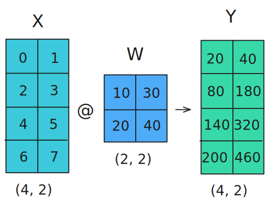

讓我們看看如何把這個運算平行化！在張量平行中，張量會沿著某個特定維度切成 $N$ 個分片（shard），分散到 $N$ 張 GPU 上。矩陣可以沿行或沿列切分，分別對應行平行與列平行。接下來我們會看到，選擇沿行或沿列切分，所需的通訊原語（communication primitives）並不相同。

我們的第一個選項是沿行切分（column-wise sharding，也稱為**行切分線性層（column-linear）**）：我們把完整的輸入矩陣複製到每個 worker 上——這需要一個稱為 **broadcast** 的操作——並把權重矩陣沿行切開。接著把輸入與各個部分權重矩陣相乘，最後再用 **all-gather** 操作把結果合併起來。

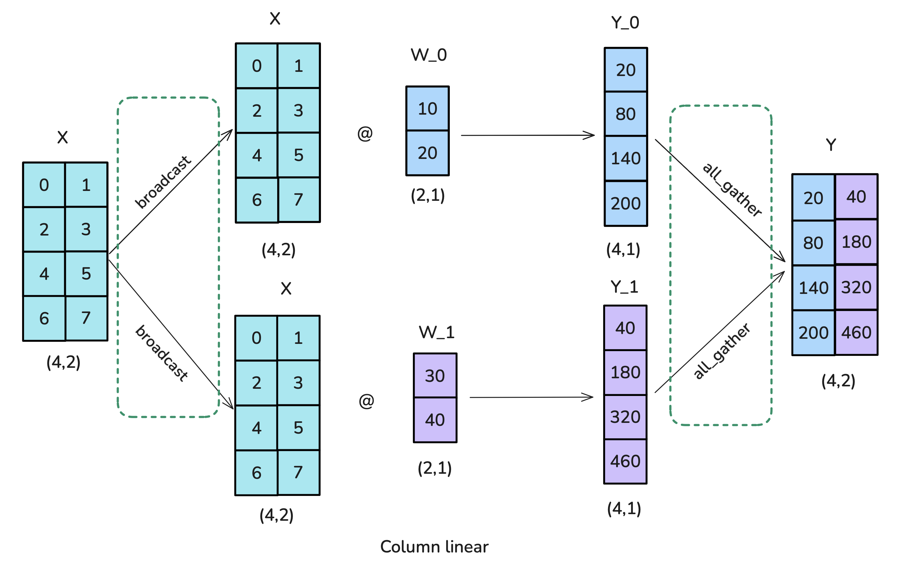

以下是行切分張量平行的程式碼實作：

> 👉 原文此處為可展開的程式碼區塊，內嵌 Picotron 的行切分（column-parallel）TP 實作，可參閱 [picotron/tensor_parallel/tensor_parallel.py#L54-L123](https://github.com/huggingface/picotron/blob/1004ae37b87887cde597c9060fb067faa060bafe/picotron/tensor_parallel/tensor_parallel.py#L54-L123)。

第二個選項稱為沿列切分（row-wise sharding，也稱為**列切分線性層（row-linear）**）：細心的讀者或許已經猜到，列切分意味著我們把權重矩陣切成一條條的列。然而，這也要求我們把輸入切開，因此需要的是 **scatter** 操作，而不是行切分時使用的 broadcast。每個 worker 上的結果形狀已經正確，但必須加總起來才是最終結果，所以這個情境還需要一次 all-reduce 操作。

我們在這裡見到了第四個分散式原語：**scatter**！

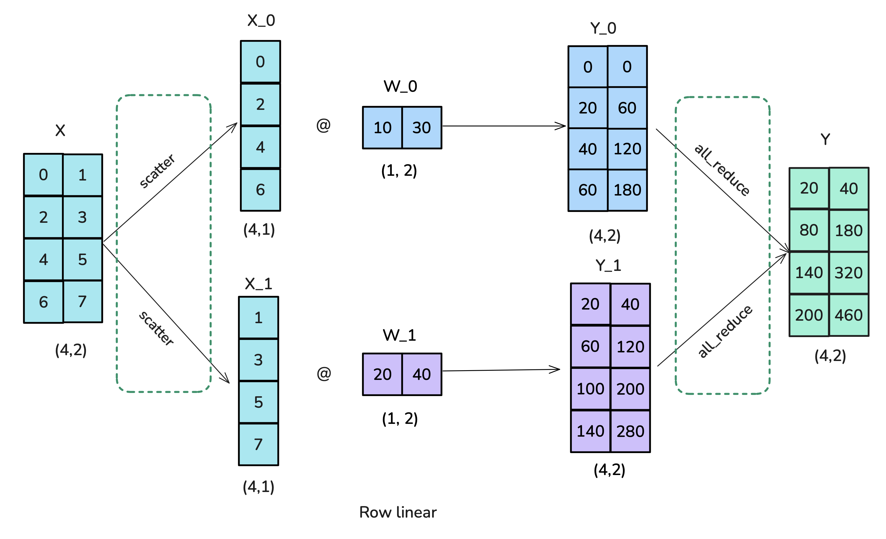

以下是列切分張量平行的實作：

> 👉 原文此處為可展開的程式碼區塊，內嵌 Picotron 的列切分（row-parallel）TP 實作，可參閱 [picotron/tensor_parallel/tensor_parallel.py#L125-L189](https://github.com/huggingface/picotron/blob/1004ae37b87887cde597c9060fb067faa060bafe/picotron/tensor_parallel/tensor_parallel.py#L125-L189)。

現在我們已經有了 TP 的基本建構元件，接著來看看如何在 Transformer 層裡有效地組合它們！

## Transformer 區塊中的張量平行

為了想出一套可以依循的策略，讓我們從玩具範例走向真實的模型建構區塊。Transformer 模型由兩種主要的建構區塊組成：前饋層（feedforward layers，即多層感知器 MLP）與多頭注意力（multi-head attention, MHA）。我們可以對兩者都套用張量平行。

前饋部分可以用「行切分線性層接列切分線性層」的方式平行化，這相當於前向傳播中一次用來複製輸入的 broadcast 與一次 all-reduce。注意在實際訓練中並不需要那次 broadcast，因為我們可以確保輸入已經在各 TP rank 之間同步。這種配置比先「列切分」再「行切分」更有效率，因為後者在兩個切分操作之間需要一次中間的 all-reduce，而前者可以省掉。

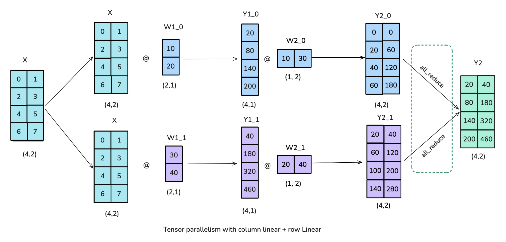

既然我們已經為 Transformer 的前饋部分找到了有效率的方案，接著來看看多頭注意力區塊（MHA）。

我們大致可以採用類似的做法：Q、K、V 矩陣以行平行（column-parallel）方式切分，輸出投影則沿列的維度切分。在多頭注意力之下，行平行的做法有非常自然的詮釋：每個 worker 負責計算單一或一部分注意力頭（head）的注意力。同樣的做法也適用於[**多查詢注意力**（multi-query attention, MQA）](https://arxiv.org/abs/1911.02150)或[**分組查詢注意力**（grouped query attention, GQA）](https://arxiv.org/abs/2305.13245)，在這些變體中鍵（key）與值（value）由多個查詢（query）共享。

不過值得注意的是，張量平行度不應超過 Q/K/V 頭的數量，因為每個 TP rank 上的頭必須保持完整（否則我們無法在每張 GPU 上獨立計算注意力，還得引入額外的通訊操作）。如果使用的是 GQA，TP 度數實際上應該小於 K/V 頭的數量。舉例來說，LLaMA-3 8B 有 8 個鍵／值頭，因此張量平行度最好不要超過 8。如果我們對這個模型使用 TP=16，就必須在每張 GPU 上複製 K/V 頭，並確保它們保持同步。

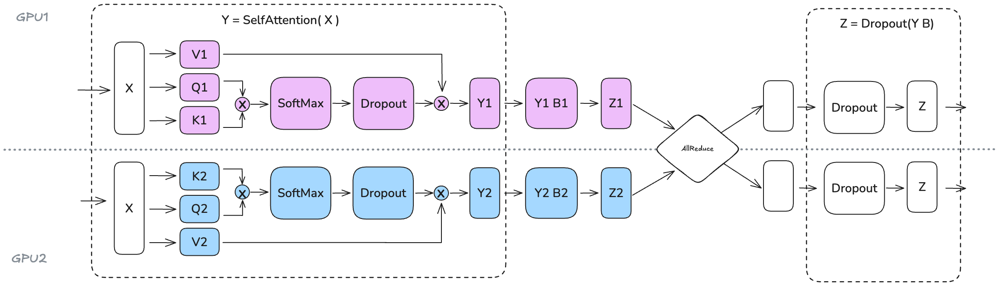

最後要注意，張量平行仍然不是訓練的萬靈丹。我們在模型的計算路徑中直接加入了數個分散式通訊原語，因此很難（像我們在 ZeRO 中做到的那樣）把它們完全隱藏或與計算重疊——最終效能將是「計算與記憶體收益」和「新增通訊開銷」之間權衡的結果。讓我們用圖來說明：

*張量平行中的前向傳播。*

> 透過區塊矩陣乘法搭配非同步的通訊／計算，可以部分隱藏這些通訊。

觀察張量平行 MLP 的操作時間軸（注意力部分也適用同樣的道理），我們能更清楚理解其中的權衡。在每個解碼器層的前向傳播中，我們會在 all-reduce 操作處碰上一個無法與計算重疊的同步點。這種*暴露通訊*（exposed communication）開銷是必要的，因為必須先在張量平行的各 rank 之間合併部分結果，才能套用最後的 LayerNorm。

> 舉例來說，Megatron-LM／Nanotron 實作了 all-gather 與 FC1 計算的部分重疊：矩陣乘法結果的一部分開始傳送到其他 GPU 的同時，另一部分仍在計算中。

張量平行確實有助於降低矩陣乘法的激活值記憶體，因為中間激活值被分片到多張 GPU 上。然而，像 LayerNorm 這樣的操作仍然需要收集完整的激活值，這表示我們沒有拿到原本可以獲得的全部記憶體好處。此外，TP 引入了相當可觀的通訊需求，其代價高度取決於網路基礎設施。這個特定的 all-reduce 無法完全隱藏在計算之後，意味著它會直接計入前向傳播的關鍵路徑（critical path）。

> 這個領域仍是活躍的研究方向，近期如 Domino 等工作正在探索最大化這種重疊的新技術。

讓我們更仔細看看隨著 TP 度數擴大時的權衡：

> 🔬 原文此處為互動圖表（TP 度數擴大時每張 GPU 的吞吐量與最大可行批次大小的變化），可至[原網頁](https://huggingface.co/spaces/nanotron/ultrascale-playbook)體驗，下圖為對應的靜態版本。

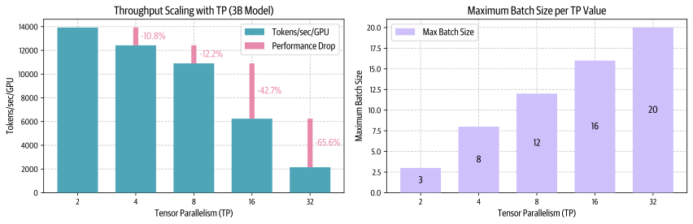

提高 TP 雖然會降低每張 GPU 的吞吐量（左圖），卻能處理更大的批次大小（右圖），呈現出分散式訓練中計算效率與記憶體可用性之間的權衡。

實務上，正如上方左圖所示，張量平行的通訊開銷在規模超過 8 張 GPU 之後變得格外明顯。單一節點內的張量平行可以利用高速的 NVLink 互連，但跨節點就必須走較慢的網路連線。從 TP=8 到 TP=16 我們觀察到明顯的下滑，而從 TP=16 到 TP=32 的下滑更為陡峭。在更高的平行度下，通訊開銷會高到很快就壓過計算時間。

話雖如此，張量平行藉由把模型參數、梯度、優化器狀態以及（某種程度上的）激活值分散到多張 GPU 上，為記憶體用量帶來重要的好處。讓我們在一個 70B 參數的模型上檢視這個效果：

> 🔬 原文此處為互動圖表（70B 模型在不同 TP 度數下的各類記憶體用量），可至[原網頁](https://huggingface.co/spaces/nanotron/ultrascale-playbook)體驗，下圖為對應的靜態版本。

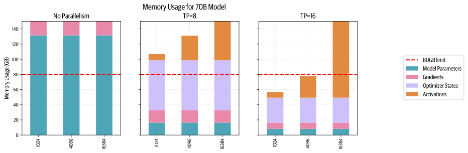

提高張量平行度能降低每張 GPU 上模型參數、梯度與優化器狀態所需的記憶體，直到我們開始能把一個大模型裝進單一節點的 8 張 GPU 裡。

有沒有辦法從這項技術獲得更多好處呢？我們已經看到，層正規化（layer normalization）與 dropout 仍然需要在每張 GPU 上收集完整的激活值，部分抵銷了記憶體節省。我們可以做得更好——只要找到方法，把這些剩下的操作也平行化。

> 📝 **註**：關於張量平行訓練中的層正規化，有一點很有意思——由於每個 TP rank 在 all-gather 之後看到的是相同的激活值，LayerNorm 的權重在反向傳播後其實不需要 all-reduce 來同步梯度：它們天然就會在各 rank 之間保持一致。不過對 dropout 操作而言，我們必須確保各 TP rank 之間的隨機種子（random seed）同步，以維持行為的確定性。

接下來，讓我們探索張量平行的一個小而自然的延伸，稱為**序列平行**（sequence parallelism），它做的正是這件事。

## 序列平行（Sequence Parallelism）

**序列平行（sequence parallelism, SP）**是指針對模型中張量平行（TP）未處理的部分——例如 Dropout 與 LayerNorm——切分其激活值與計算，但切分的方向是沿著輸入的序列維度，而不是隱藏維度（hidden dimension）。

> 📝 **註**：「序列平行」這個術語有點過載：本節所說的序列平行與張量平行緊密耦合，適用於 dropout 與層正規化操作。然而，當我們之後處理更長的序列時，注意力計算會成為瓶頸，這需要 Ring Attention 之類的技術——它們有時也被稱為*序列平行*，但為了區分這兩種做法，我們會把後者稱為*上下文平行*（context parallelism）。所以之後每次看到「序列平行」，請記得它是與張量平行搭配使用的（相對地，上下文平行則可以獨立使用）。

之所以需要這麼做，是因為這些操作需要存取完整的隱藏維度才能正確計算。舉例來說，LayerNorm 需要完整的隱藏維度來計算平均值與變異數：

$$
\text{LayerNorm}(x) = \gamma \cdot \frac{x - \mu}{\sqrt{\sigma^2 + \epsilon}} + \beta
$$

其中 $\mu = \text{mean}(x)$ 與 $\sigma^2 = \text{var}(x)$ 是沿著隱藏維度 $h$ 計算的。

因此，即使這些操作在計算上很便宜，它們仍然需要可觀的激活值記憶體，因為它們需要完整的隱藏維度。SP 讓我們改沿序列維度切分，把這份**記憶體**負擔分片到多張 GPU 上。

實務上，我們會從左圖過渡到右圖：

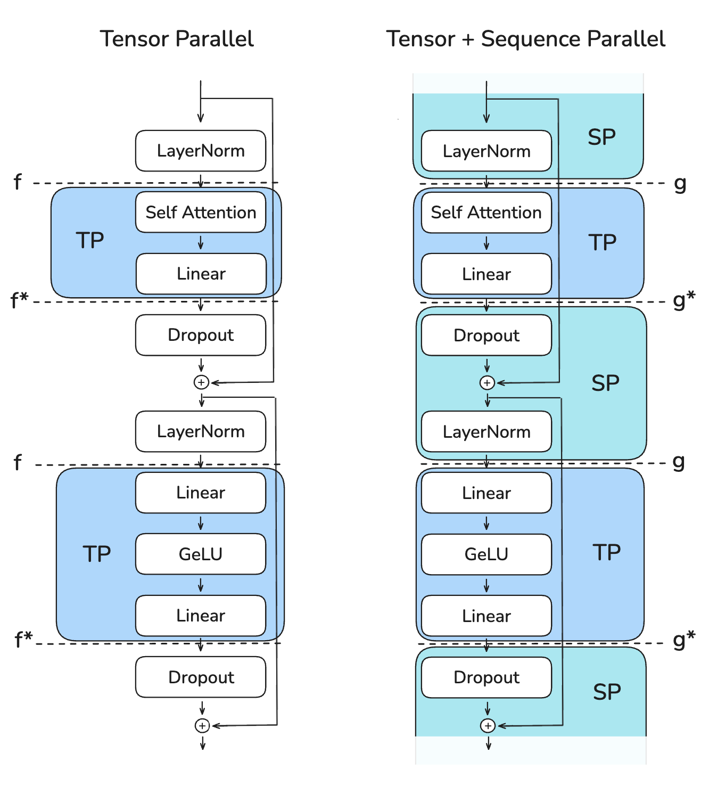
*前向傳播中：f = no-op；f\* = all-reduce；g = all-gather；g\* = reduce-scatter。反向傳播中：f = all-reduce；f\* = no-op；g = reduce-scatter；g\* = all-gather。SP 區域需要完整的 hidden_dim。*

這張圖顯示了我們如何利用不同的集體通訊操作（標記為「f」與「g」）在張量平行區域與序列平行區域之間過渡。關鍵挑戰在於有效率地管理這些過渡，同時維持低記憶體用量並確保正確性。

在前向傳播中：

* 「f」是 no-op（不做任何操作），因為激活值已經在各 rank 之間重複存在
* 「f\*」是 all-reduce，用來同步激活值並確保正確性

在反向傳播中：

* 「f\*」是 no-op，因為梯度已經在各 rank 之間重複存在
* 「f」是 all-reduce，用來同步梯度

「f」與「f\*」這對操作被稱為**共軛**（conjugate）配對，因為它們彼此互補——當其中一個在前向是 no-op 時，另一個在反向就是 all-reduce，反之亦然。

至於序列平行（SP），我們使用標記為「g」與「g\*」的不同操作。具體來說，我們會避免在 SP 區域使用 all-reduce，因為那需要收集完整的激活值，會推高峰值記憶體用量，違背了 SP 的初衷。

那麼這裡究竟發生了什麼事？就像某個著名的 LLM 會說的：讓我們一步一步來看（step by step）：

**最初的 LayerNorm（SP 區域）**

* 輸入張量 $X_1^*$ 與 $X_2^*$（形狀 $(b, s/2, h)$）進入 LayerNorm，已沿序列維度切分
* 每張 GPU 在自己的序列片段上獨立計算 LayerNorm，得到 $Y_1^*$ 與 $Y_2^*$

**第一次過渡（SP → TP）**

* 「g」操作（all-gather）把 $Y_1^*$ 與 $Y_2^*$ 合併回完整的序列長度
* 恢復出 $Y$（形狀 $(b, s, h)$），因為行切分線性層需要完整的隱藏維度 $h$

**第一個線性層（TP 區域）**

* $A_1$ 是行切分線性層，因此會沿隱藏維度切分 $Y$
* GeLU 在每張 GPU 上獨立套用
* $Z_1^*$ 的形狀為 $(b, s, h/2)$

**第二個線性層（TP 區域）**

* $B_1$ 是列切分線性層，因此會恢復隱藏維度
* $W_1$ 的形狀為 $(b, s, h)$

**最後的過渡（TP → SP）**

* 「g\*」操作（reduce-scatter）：一邊為前面的列切分線性層完成正確性所需的 reduce，一邊沿序列維度 scatter
* $W_1^*$ 的形狀為 $(b, s/2, h)$

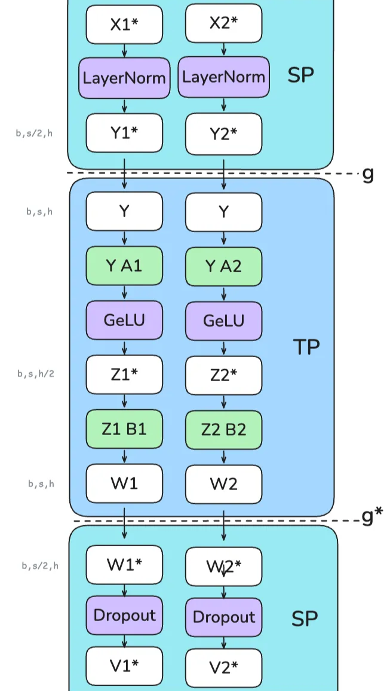

序列平行的一大優勢在於，它降低了我們需要儲存的最大激活值尺寸。如果只用張量平行，我們必須在多個位置儲存形狀為 $(b, s, h)$ 的激活值；有了序列平行，最大激活值尺寸就降為 $\frac{b \cdot s \cdot h}{tp}$，因為我們總是沿著序列維度或隱藏維度其中之一切分。

要記住 TP 與 TP/SP 中各部分不同的切分方式有點困難——相信我們，我們自己也覺得很難對應——所以我們做了這張小表，總結激活值（也就是 `hidden_states`）的形狀在前向傳播過程中沿隱藏維度 $h$ 與序列維度 $s$ 的變化：

| 區域 | 僅 TP | TP 搭配 SP |
|---|---|---|
| 進入 TP（行切分線性層） | $h$：分片（`weight_out` 為分片） $s$：完整 | $h$：分片（`weight_out` 為分片） $s$：**all-gather** 成完整 |
| TP 區域 | $h$：分片 $s$：完整 | $h$：分片 $s$：完整 |
| 離開 TP（列切分線性層） | $h$：完整（`weight_out` 為完整 + 為正確性做 **all-reduce**） $s$：完整 | $h$：完整（`weight_out` 為完整 + 為正確性做 **reduce-scatter**） $s$：**reduce-scatter** 成分片 |
| SP 區域 | $h$：完整 $s$：完整 | $h$：完整 $s$：分片 |

而對嵌入層（embedding layer）而言：

| 區域 | 純 TP（vanilla TP） | TP 搭配 SP |
|---|---|---|
| 嵌入層（列切分線性層，沿詞彙表切分） | $h$：完整（`weight_out` 為完整 + 為正確性做 **all-reduce**） $s$：完整 | $h$：完整（`weight_out` 為完整 + 為正確性做 **reduce-scatter**） $s$：**reduce-scatter** 成分片 |

藉由序列平行，我們能達成更大的激活值記憶體節省，讓批次大小與序列長度得以推進到只用張量平行時無法達到的程度。來看看這對我們先前的 70B 模型範例意味著什麼：

> 🔬 原文此處為互動圖表（70B 模型在 TP/SP 之下、不同序列長度時的記憶體用量），可至[原網頁](https://huggingface.co/spaces/nanotron/ultrascale-playbook)體驗，下圖為對應的靜態版本。

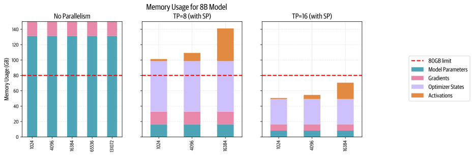

如圖所示，我們再次大幅降低了每張 GPU 的最大記憶體用量，讓我們能在 TP/SP=16 之下容納 16k token 的序列長度，比純 TP 的情況更進一步！（如前一節所見，TP=16 還是有點大，但我們會在下一節看到如何改進。）

你可能會問自己：使用 TP+SP 是否比純 TP 產生更多通訊？嗯，可以說是，也可以說不是。在純 TP 的前向傳播中，每個 Transformer 區塊有兩次 all-reduce；而在 SP 中，每個 Transformer 區塊有兩次 all-gather 與兩次 reduce-scatter。所以 SP 的通訊操作次數是 TP 的兩倍。但由於一次 all-reduce 操作可以拆解為一次 all-gather 加一次 reduce-scatter（見附錄的〈Ring AllReduce 快速聚焦〉一節），兩者在通訊上其實是等價的。反向傳播的推理也相同，因為我們只是使用每個操作的共軛（no-op ↔ all-reduce、all-gather ↔ reduce-scatter）。

如果你一直很專心，就會注意到我們談的是每層 4 次通訊操作（注意力 2 次、MLP 2 次）。使用張量平行＋序列平行時，MLP 的效能剖析（profiling）看起來是這樣：

和純 TP 一樣，TP+SP 也不容易與計算重疊，這使得吞吐量高度依賴通訊頻寬。同樣和純 TP 一樣，TP+SP 通常只會在單一節點內進行（讓 TP 度數不超過每個節點的 GPU 數，例如 TP≤8）。

我們可以實際量測這種通訊開銷在張量平行擴大時如何變得越來越棘手。讓我們在一個 3B 模型、序列長度 4096 的設定下，量測 TP 搭配 SP 擴大時的吞吐量與記憶體使用率：

> 🔬 原文此處為互動圖表（3B 模型、序列長度 4096 下，TP 搭配 SP 擴大時的吞吐量與記憶體容量），可至[原網頁](https://huggingface.co/spaces/nanotron/ultrascale-playbook)體驗，下圖為對應的靜態版本。

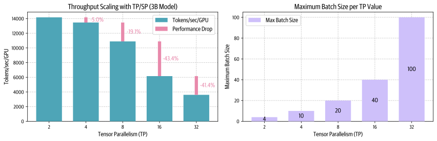

這裡同樣存在計算效率（左圖）與記憶體容量（右圖）之間的權衡：更高的平行度雖然藉由降低激活值記憶體而能處理明顯更大的批次大小，卻也會降低每張 GPU 的吞吐量——尤其是在超過「每個節點的 GPU 數」這個門檻之後。

讓我們總結一下觀察到的現象：

* 對這兩種方法而言，最大的效能下滑都出現在從 TP=8 移到 TP=16 的時候，因為那正是通訊從單一節點之內（NVLink）跨入節點之間（EFA）的時刻
* 使用 TP 搭配 SP 時的激活值記憶體節省，讓我們能容納比只用 TP 時大得多的批次

**我們已經看到 TP 如何藉由沿隱藏維度切分注意力與前饋操作，把激活值分片到多張 GPU 上；也看到 SP 如何沿序列維度切分其餘的操作，成為 TP 的自然互補。**

> 📝 **註**：由於 SP 區域中的 LayerNorm 作用在序列的不同部分上，它們的梯度在各 TP rank 之間會不一樣。為了確保權重保持同步，我們需要在反向傳播時對它們的梯度做 all-reduce，就像 DP 確保權重同步的方式一樣。不過這只是很小的通訊開銷，因為 LayerNorm 的參數相對很少。

然而，TP 與 SP 有兩個限制：1）如果我們擴大序列長度，TP 區域的激活值記憶體仍然會爆增；2）如果模型大到 TP=8 也裝不下，我們就會因為跨節點的連線而遭遇大幅度的變慢。

問題 1）可以用上下文平行（context parallelism）來解決，問題 2）則可以用管線平行（pipeline parallelism）來解決。讓我們先來看看上下文平行！
