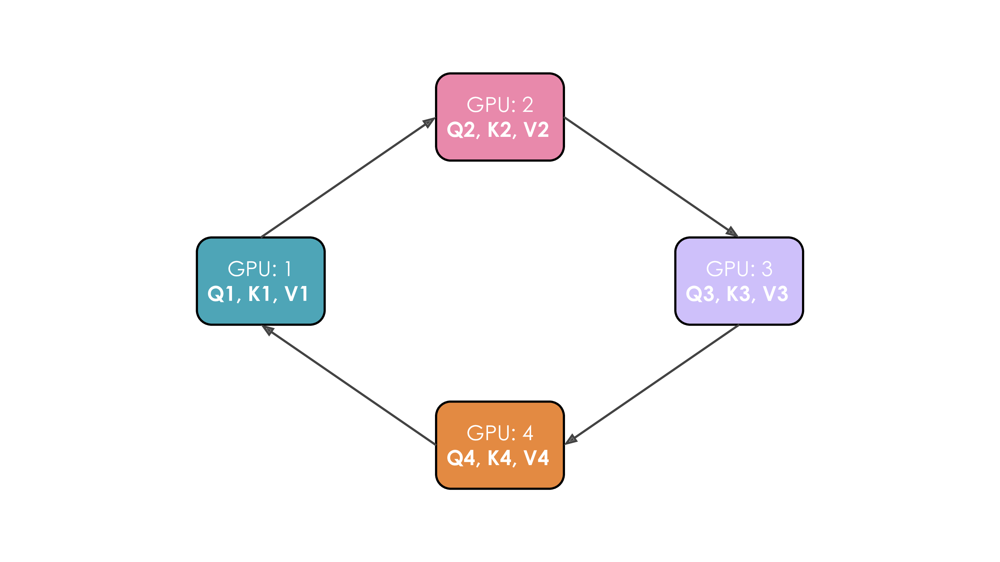
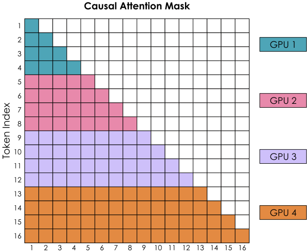
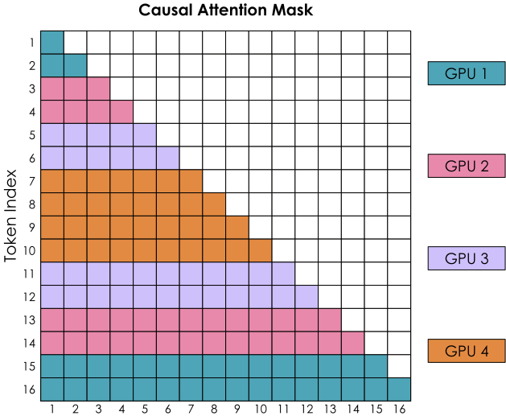
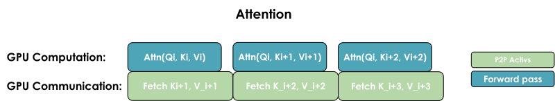

# 第 4 章　上下文平行（Context Parallelism）

> 譯自 Hugging Face nanotron 團隊《The Ultra-Scale Playbook: Training LLMs on GPU Clusters》（Apache 2.0），原文為 [Hugging Face Space](https://huggingface.co/spaces/nanotron/ultrascale-playbook)。

有了張量平行（tensor parallelism, TP）與序列平行（sequence parallelism, SP），我們已經能大幅降低每顆 GPU 的記憶體需求，因為模型權重與激發值（activations）都分散到多顆 GPU 上了。然而，當我們要在越來越長的序列上訓練模型（例如每條序列擴展到 128k 個以上的 token）時，仍可能超出單一節點的可用記憶體，因為在 TP 區域內部，我們依然得處理完整長度的序列。

此外，即使我們對激發值採用完整重算（full recomputation）——這會帶來約 30% 的沉重計算負擔——我們仍需在記憶體中保留層邊界處的部分激發值，而這些激發值會隨序列長度線性成長。讓我們來看看上下文平行（context parallelism, CP）能幫上什麼忙：

> 🔬 原文此處為互動圖表（8B 模型在不同上下文平行度下的記憶體用量），可至[原網頁](https://huggingface.co/spaces/nanotron/ultrascale-playbook)體驗。

上下文平行的核心想法，是把類似序列平行的做法（也就是沿著序列長度切分）套用到我們已經施加張量平行的那些模組上。如此一來，這些模組會沿著兩個維度切分，從而也降低了序列長度帶來的影響。走過前面這些內容之後，你應該會覺得這個做法相當直觀……但其中有個訣竅，所以請保持清醒！

採用上下文平行時，就像序列平行一樣，我們沿著序列維度切分輸入；但這次我們把這個切分套用到整個模型，而不是像先前 TP + SP 那樣，只切在模型的序列平行區域。

切分序列並不影響 MLP、LayerNorm 等大多數模組，因為其中每個 token 都是獨立處理的。它也不像 TP 需要昂貴的通訊，因為被切分的只有輸入，而不是權重矩陣。和資料平行（data parallelism）一樣，在算完梯度之後，我們會發起一次 all-reduce 操作，在上下文平行群組內同步梯度。

不過有一個重要的例外：我們得特別「注意」**注意力區塊**（attention blocks）（哈哈……雙關語無誤 :D）。在注意力模組中，每個 token 都需要存取來自**所有**其他序列 token 的鍵／值對（key/value pairs）；就算是因果注意力（causal attention），至少也得關注每一個先前的 token。

由於上下文平行是沿著序列維度把輸入切分到多顆 GPU 上，注意力模組將需要 GPU 之間的完整通訊，來交換所需的鍵／值資料。

如果我們天真地直接這麼做，代價聽起來相當昂貴。有沒有辦法把這件事做得又省又快呢？幸好有：有一項核心技術能讓我們有效率地處理這些鍵／值對的通訊，它就叫做**環狀注意力（Ring Attention）**。

> 📝 **註**：上下文平行與 FlashAttention（後文會再詳細介紹）在概念上有些相似——兩者都依賴線上 Softmax（online softmax）計算來降低記憶體用量。差別在於 FlashAttention 專注於最佳化單顆 GPU 上的注意力計算本身，而上下文平行則是透過把序列分散到多顆 GPU 上來達成記憶體的縮減。

### 初探環狀注意力（Ring Attention）

在這種注意力機制的實作中，每顆 GPU 會先發起一個非同步通訊操作，把自己的鍵／值對送往其他 GPU。在等待其他 GPU 資料的同時，它會對手上已有的那部分資料計算注意力分數。理想情況下，在這輪計算結束之前，就能從另一顆 GPU 收到下一份鍵／值對，讓這顆 GPU 一算完就能立刻展開下一輪計算。

讓我們把這個過程具體畫出來。假設我們有 4 顆 GPU、輸入為 4 個 token。一開始，輸入序列沿著序列維度均勻切分，因此每顆 GPU 只會拿到一個 token 及其對應的 Q/K/V 值。假設 Q1、K1、V1 分別代表第一個 token 的查詢（query）、鍵（key）與值（value），它們位於第 1 顆 GPU 上。整個注意力計算需要 4 個時間步才能完成。在每個時間步中，每顆 GPU 依序執行以下三個操作：

1. 以非阻塞（non-blocking）的方式，把「目前的鍵與值」送給下一台機器（最後一個時間步除外），如此我們就能在這一步還沒結束前，先展開後續的步驟。
2. 在本地對手上已有的「目前的鍵與值」計算注意力分數，這通常就是計算 $Softmax(\frac{QK^T}{\sqrt{d}}) * V$。
3. 等待從前一顆 GPU 收到鍵與值，然後回到步驟 1，此時「目前的鍵與值」就換成剛剛從前一顆 GPU 收到的鍵／值。

我們把這 3 個步驟執行四次，就能完成整個注意力計算。

以 4 顆 GPU 進行的完整流程如下面的動畫所示：

*4 顆 GPU 以環狀方式傳遞鍵／值對、同時計算注意力的完整過程動畫。*

看了這個動畫，你大概就一目瞭然作者為什麼把這個方法命名為「環狀注意力」了。

不過這裡有個大問題：環狀注意力的天真實作，會因為因果注意力矩陣的形狀，造成 GPU 之間嚴重的負載不均。讓我們透過帶有因果注意力遮罩（causal attention mask）的注意力分數矩陣，來檢視 Softmax 的計算：

*天真的順序切分下，因果注意力遮罩對應的注意力分數矩陣：各 GPU 分到的計算量嚴重不均。*

Softmax 是逐列（row-wise）計算的，也就是說，只要某顆 GPU 收齊了某一列的所有 token，那一列就可以開始計算。我們可以看到，GPU 1 可以立刻計算，因為它一開始就握有 token 1–4，完全不需要從其他任何 GPU 接收資訊。然而 GPU 2 得等到第二輪才能收到 token 1–4，才湊齊 token 1–8 的所有值。而且，GPU 1 的工作量看起來也遠比其他所有 GPU 少得多。

讓我們看看能不能把計算分配得更平均一些：

### 鋸齒環狀注意力（Zig-Zag Ring Attention）——計算平衡的實作

我們需要更好的輸入序列分配方式。做法是不再把 token 純粹按順序指派給各 GPU，而是稍微打散排列順序，讓每顆 GPU 上都均勻混有前段與後段的 token。這個方法稱為鋸齒注意力（Zig-Zag Attention）。在這種新的排列下，注意力遮罩會呈現均勻分布的計算量；只要數一數塗色方格的數量，你就會發現計算現在已經平均分攤到所有 GPU 上了。

> 📝 **註**：我們這裡展示的是鋸齒注意力（Zig-Zag Attention），它與條紋注意力（Striped Attention）略有差異；關於兩者差異的細節，可參考[這則 GitHub 討論](https://github.com/zhuzilin/ring-flash-attention/issues/2#issuecomment-2236746166)。

*鋸齒排列下的注意力遮罩：計算量已平均分攤到所有 GPU。*

同時我們也會發現，若要完成所有的列，每顆 GPU 都需要來自其他所有 GPU 的資訊。

要讓計算與通訊重疊，一般有兩種做法：一是執行一次整體的 all-gather，同時把所有 KV 重新聚集到每顆 GPU 上（類似 ZeRO-3 的方式）；二是依需求逐一從各 GPU 收集到各 GPU 上：

*All-gather 實作：一次同時收齊所有鍵／值對。*

*All-to-all（環狀）實作：以環狀模式一次交換一個區塊的鍵／值對。*

這兩種實作的關鍵差異，在於它們的通訊模式與記憶體用量：

**1. All-gather 實作：**

* 所有 GPU 同時向其他所有 GPU 收集完整的鍵／值對
* 需要較多暫存記憶體，因為每顆 GPU 必須一次存放完整的 KV 對
* 通訊一步到位，但記憶體開銷較大

**2. All-to-all（環狀）實作：**

* GPU 以類似環狀的模式交換 KV 對，一次一個區塊
* 記憶體效率較佳，因為每顆 GPU 一次只需暫存一個額外的區塊
* 通訊被分散開來並與計算重疊，不過多次通訊步驟會帶來一些額外的基礎延遲開銷

整體而言，all-to-all 做法以稍微複雜一點的通訊模式為代價，換得較佳的記憶體效率；all-gather 做法則較為簡單，但在注意力計算期間需要較多的暫存記憶體。

到目前為止，我們已經看到如何在單一節點內用 TP 切分模型來馴服大型模型，也看到可以用 CP 來馴服長序列造成的激發值爆炸。

然而，我們也知道 TP 難以跨節點擴展，那麼當模型權重連一個節點都不容易塞下時，該怎麼辦呢？這時就輪到另一個平行維度——我們的第四種平行方式：**管線平行（Pipeline Parallelism）**——出場救援了！
