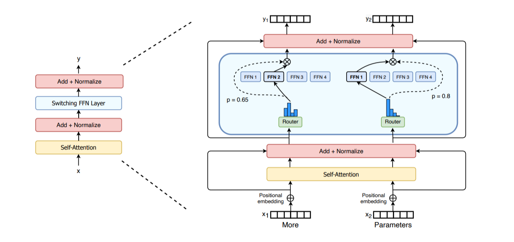
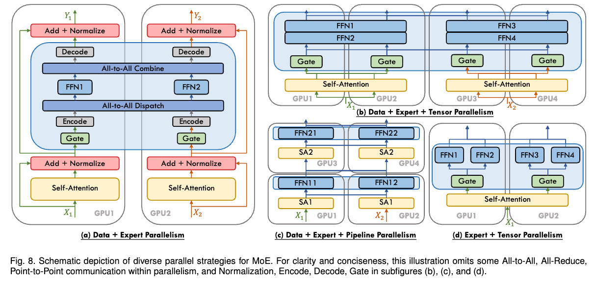

# 第 6 章　專家平行（Expert Parallelism）
> 譯自 Hugging Face nanotron 團隊《The Ultra-Scale Playbook: Training LLMs on GPU Clusters》（Apache 2.0），原文為 [Hugging Face Space](https://huggingface.co/spaces/nanotron/ultrascale-playbook)。

這是我們要討論的最後一種平行方法。在深入探討之前，如果你從未接觸過混合專家（Mixture of Experts, MoE）模型，不妨先讀讀我們先前發表的[這篇篇幅短得多的部落格文章](https://huggingface.co/blog/moe)，它應該能幫助你更全面地理解 MoE 架構。

混合專家模型近來隨著 GPT-4、Mixtral，以及更晚近的 DeepSeek-V3/R1 等模型而備受矚目。其基本想法是：每一層不再只有單一個前饋（feedforward）模組，而是可以有多個平行的模組，並將 token 路由（route）到其中某一個模組，以不同的方式處理。

*MoE 層的示意圖，取自 Switch Transformers 論文*

MoE 層的設計讓我們很容易沿著專家這個維度實作平行化，也就是我們所稱的**專家平行（expert parallelism, EP）**。由於各個前饋層彼此完全獨立，我們可以直接把每個專家的前饋層放到不同的工作節點（worker）上。相較於張量平行（tensor parallelism, TP），這種做法輕量許多：我們不需要切分矩陣乘法，只需要把 token 的隱藏狀態路由給正確的專家即可。

實務上，EP 通常會與其他形式的平行搭配使用——例如資料平行（data parallelism, DP）。這是因為 EP 只影響 MoE 層，並不會切分輸入的 token（不像上下文平行（context parallelism, CP）會沿著序列長度維度切分 token）。這表示如果我們只使用 EP，GPU 就會對所有非 MoE 的區塊做重複的計算。透過將 EP 與 DP 結合，我們就能有效率地把專家和輸入批次都切分到各個 GPU 上，如下方的簡化示意圖所示：

*資料來源：《A Survey on Mixture of Experts》*

不過我們先別操之過急——接下來的一節會專門討論不同平行策略之間的各種交互作用，所以如果你還看不懂最後這張圖，也不用擔心。

實務上，要讓 EP 高效運作有一些技巧，而且這些技巧與模型設計緊密相關。舉例來說，DeepSeek-V3 在路由器（router）中施加了一項限制，確保每個 token 至多只會被送往 $M$ 個節點（在他們的設定中是 4 個），以便把 token 留在單一節點上、減少通訊開銷。雖然專家平行已經存在一段時間了，但隨著 MoE 架構日益受到關注，它如今才重新獲得青睞。

我們計劃不久之後在 picotron/nanotron 中加入更完整的 EP 範例，敬請期待！
