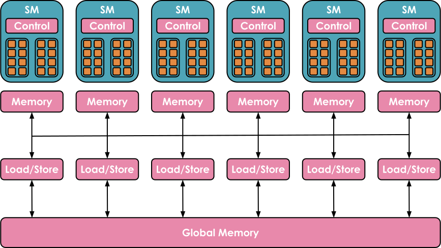
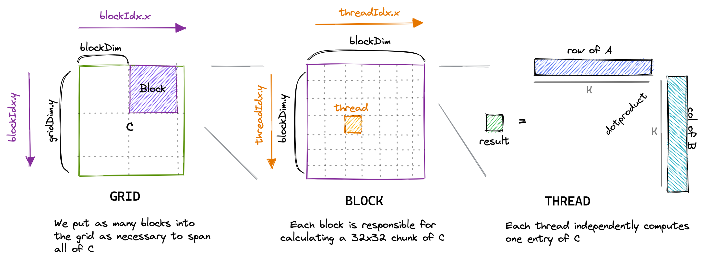
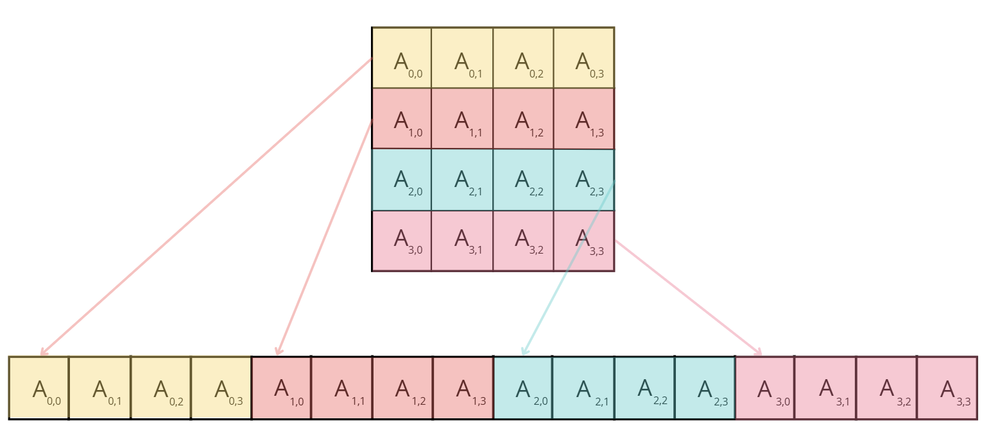

# 第 9 章　深入 GPU：架構與核心（Diving in the GPUs: Architecture & Kernels）

> 譯自 Hugging Face nanotron 團隊《The Ultra-Scale Playbook: Training LLMs on GPU Clusters》（Apache 2.0），原文為 [Hugging Face Space](https://huggingface.co/spaces/nanotron/ultrascale-playbook)。本章為原書「Diving in the GPUs」前半。

> 🎧 原文此處嵌入了一段由 NotebookLM 主持人討論本章內容的 Podcast 音訊，讓你在閱讀時能有邊聽邊讀的體驗，可至[原網頁](https://huggingface.co/spaces/nanotron/ultrascale-playbook)聆聽。

到目前為止，我們的討論都聚焦在模型運算的高層次組織方式：我們在各個加速器之間搬移計算，考量整體的記憶體限制與計算單元的高層次排程。

但這忽略了另一個層面——只要仔細理解模型運算在每張 GPU 上是如何被排程與執行的，我們還可以在低得多的層級上做各種最佳化。

本節將深入探討 GPU 架構的更多細節，特別是 NVIDIA 的 GPU 架構；不過一如既往，這些一般性的概念也能套用到其他類似的加速器上。

我們會先簡要說明 GPU 的組織方式，接著介紹 Flash-Attention 帶來的革命、如何有效率地在 GPU 上排程工作負載，最後說明如何在 GPU 上有效率地運用各種數值精度。

## GPU 基礎入門（A primer on GPU）

一般而言，GPU 具有非常階層化的組織結構。在這份入門介紹中，我們只會停留在後續內容所需的概念層次。

在計算方面，GPU 由一整排稱為**串流多處理器（Streaming Multiprocessor, SM）**的計算單元組成。每個 SM 包含並控制一組串流處理器，也就是俗稱的核心（core）。舉例來說，一張 NVIDIA H100 GPU 有 132 個 SM，每個 SM 有 128 個核心，總計 16,896 個核心（詳見 [Tensor Core 文件](https://resources.nvidia.com/en-us-tensor-core)），每個核心都能同時處理多條執行緒。



*圖片來源：https://blog.codingconfessions.com/p/gpu-computing*

記憶體方面同樣高度階層化，由多層快取與記憶體構成：**暫存器（register）**是最小的單位，在執行期間為各執行緒所私有；**共享記憶體（shared memory）**與 **L1 快取**由同一個 SM 上執行的執行緒共用；再往上是所有 SM 共用的 **L2 快取**；最後是**全域記憶體（global memory）**，它是 GPU 上容量最大的記憶體（例如 H100 廣告上標示的 80 GB），但存取與查詢的速度也最慢。


*圖片來源：https://www.youtube.com/watch?v=ZQKMZIP3Fzg*

使用 GPU 的目標，就是善用這種計算／記憶體的階層式組織，讓儘可能多的工作負載在 GPU 核心上平行執行。

在 GPU 核心上執行的一段程式碼稱為 **kernel**。它可以用 **CUDA** 或 **Triton** 等高階語言撰寫，然後編譯成 Parallel Thread Execution（PTX）——NVIDIA GPU 使用的低階組合語言。

要執行 kernel，你還需要一段特定的程式碼，稱為**主機端程式碼（host code）**，它在 **CPU／主機**上執行，負責準備資料配置、載入資料與程式碼：

```cpp
// 主機端程式碼（host code）
void vecAdd(float* h_A, float *h_B, float *h_c, int n) {
    // 在裝置記憶體中配置向量
    int size = n * sizeof(float);
    float *d_A, *d_B, *d_C;
    cudaMalloc(&d_A, size);
    cudaMalloc(&d_B, size);
    cudaMalloc(&d_C, size);

    // 將向量從主機記憶體複製到裝置記憶體
    cudaMemcpy(d_A, h_A, size, cudaMemcpyHostToDevice);
    cudaMemcpy(d_B, h_B, size, cudaMemcpyHostToDevice);

    // 啟動 kernel
    int threadsPerBlock = 256;
    int blocksPerGrid =
            (N + threadsPerBlock - 1) / threadsPerBlock;
    VecAdd<<<blocksPerGrid, threadsPerBlock>>>(d_A, d_B, d_C, N);

    // 將結果從裝置記憶體複製回主機記憶體
    // h_C 保存主機記憶體中的結果
    cudaMemcpy(h_C, d_C, size, cudaMemcpyDeviceToHost);

    // 釋放裝置記憶體
    cudaFree(d_A);
    cudaFree(d_B);
    cudaFree(d_C);
}
```

*兩向量相加 CUDA kernel 的主機端程式碼，改編自 https://docs.nvidia.com/cuda/cuda-c-programming-guide/ 與 https://blog.codingconfessions.com/p/gpu-computing*

```cpp
// 裝置端程式碼（device code）
__global__ void VecAdd(float* A, float* B, float* C, int N)
{
    int i = blockDim.x * blockIdx.x + threadIdx.x;
    if (i < N)
        C[i] = A[i] + B[i];
}
```

*裝置端程式碼，內含向量加法 kernel 的定義，改編自 https://docs.nvidia.com/cuda/cuda-c-programming-guide/ 與 https://blog.codingconfessions.com/p/gpu-computing*

Kernel 的排程方式一般如下：

* 執行緒以 32 條為一組，組成**執行緒束（warp）**。同一個 warp 內的所有執行緒會同步地同時執行相同的指令，只是作用在資料的不同部分上。
* 多個 warp 再組成更大、大小較有彈性的**區塊（block）**（例如大小為 256），每個 block 仍然只會被指派給單一一個 SM。一個 SM 可以平行執行多個 block；不過視資源而定，並非所有 block 都能立刻被指派執行，有些會被排入等候清單，等待資源釋出。

從這些細節中最需要記住的一點是：GPU 存在各式各樣的大小與配置限制（各層記憶體的容量、可並行的 block 數量與 warp 中的執行緒數量），必須將這些限制納入考量，才能以最有效率的方式使用 GPU 架構。

大多數時候你並不需要深入到這種精細的層次，而且幸運的是，你通常可以直接重用社群其他成員準備好的 kernel 與程式碼。但無論如何，我們還是想帶你入門，看看該如何開始撰寫 kernel！

## 如何用 kernel 提升效能？（How to improve performance with Kernels?）

如果你想新增一個還沒有最佳化 kernel 的運算，或是想加速某個既有的 PyTorch 函式，從零開始撰寫 kernel 看起來或許是最直接的途徑。然而，從頭打造高效能的 CUDA kernel 需要豐富的經驗，學習曲線也相當陡峭。通常比較好的入門方式是利用 `torch.compile`：它會捕捉你的運算並動態最佳化 PyTorch 程式碼，生成以 Triton 撰寫的低階高效能 kernel。

假設你想為一個叫做指數線性單元（Exponential Linear Unit, ELU）的激勵函數撰寫 kernel：

$$
\text{ELU}(x) = \begin{cases}
e^x - 1 & \text{if } x < 0 \\
x & \text{if } x \geq 0
\end{cases}
$$

你可以先寫一個簡單的 PyTorch 實作，然後在上面加上 `@torch.compile` 裝飾器即可：

```python
@torch.compile
def elu(x, alpha=1.0):
    return torch.where(x < 0, alpha * (torch.exp(x) - 1), x)
```

編譯版與未編譯版之間的差距非常驚人，尤其是考慮到我們只加了一個裝飾器而已。下圖清楚呈現了這個顯著的差異（其中 $N$ 為行數）：


不過，如果這樣的效能提升還不夠，你可以考慮自行實作 Triton kernel。作為起點，你可以先看看 `@torch.compile` 生成的 Triton kernel。方法很簡單，只要把環境變數 `TORCH_LOGS` 設為 `"output_code"`：

```bash
export TORCH_LOGS="output_code"
```

接著執行帶有 `@torch.compile` 裝飾器的 Python 腳本，它就會生成並輸出對應的 Triton kernel，在這個例子中是：

```python
@triton.jit
def triton_(in_ptr0, out_ptr0, xnumel, XBLOCK : tl.constexpr):
    xnumel = 100000000
    xoffset = tl.program_id(0) * XBLOCK
    xindex = xoffset + tl.arange(0, XBLOCK)[:]
    xmask = xindex < xnumel
    x0 = xindex
    tmp0 = tl.load(in_ptr0 + (x0), xmask)
    tmp1 = 0.0
    tmp2 = tmp0 < tmp1
    tmp3 = tl_math.exp(tmp0)
    tmp4 = 1.0
    tmp5 = tmp3 - tmp4
    tmp6 = tl.where(tmp2, tmp5, tmp0)
    tl.store(out_ptr0 + (x0), tmp6, xmask)
```

為了提升可讀性，我們可以修改變數名稱、加上註解，並做些微調（或請 LLM 幫我們做），如下所示：

```python
@triton.jit
def elu_kernel(input_ptr, output_ptr, num_elements, BLOCK_SIZE: tl.constexpr):
    # 計算此區塊的起始索引
    block_start = tl.program_id(0) * BLOCK_SIZE
    # 建立此區塊的索引陣列
    block_indices = block_start + tl.arange(0, BLOCK_SIZE)[:]
    # 建立遮罩，確保只處理有效的索引
    valid_mask = block_indices < num_elements
    # 依據有效索引，從輸入指標載入輸入值
    input_values = tl.load(input_ptr + block_indices, valid_mask)
    # 定義 ELU 的參數
    zero_value = 0.0  # ELU 激勵的門檻值
    negative_mask = input_values < zero_value
    exp_values = tl.math.exp(input_values)
    # 定義 ELU 輸出的位移量
    one_value = 1.0
    shifted_exp_values = exp_values - one_value

    output_values = tl.where(negative_mask, shifted_exp_values, input_values)

    # 將計算好的輸出值寫回輸出指標
    tl.store(output_ptr + block_indices, output_values, valid_mask)
```

這裡的 `tl.program_id(0)` 會提供一個唯一的 block ID，我們用它來決定該 block 要處理哪一段資料。利用這個 block ID，`block_start` 計算出每個 block 負責區段的起始索引，而 `block_indices` 則指定該區段內的索引範圍。`valid_mask` 確保只有 `num_elements` 範圍內的索引會被處理，讓 `tl.load` 能安全地載入資料。接著套用 ELU 函數，依據數值是否為負來修改它們，最後用 `tl.store` 把結果寫回記憶體。

當我們用 `triton.testing.Benchmark` 對生成的 kernel 進行基準測試時，得到以下效能：


這個獨立的 kernel 在較小的尺寸下甚至展現出比 `@torch.compile` 更好的效能，但這很可能只是 `torch.compile` 編譯時間造成的假象。無論如何，請記住：與其從零開始，你可以從這類自動生成的 kernel 出發，把精力集中在最佳化其效能上，替自己省下大量時間。

即使用了 Triton，有時我們仍然無法完全榨出裝置的峰值效能，因為這個語言在處理低階細節——例如共享記憶體以及串流多處理器（SM）內部的排程——上有其限制。Triton 的能力僅止於 block 層級，以及 block 在各 SM 之間的排程。若想取得更深入的控制權，你就需要直接用 CUDA 實作 kernel，在那裡你可以觸及所有底層的低階細節。

下探到 CUDA 之後，有各式各樣的技巧可以用來提升 kernel 的效率。這裡我們只介紹其中幾種：最佳化記憶體存取模式以降低延遲、利用共享記憶體存放頻繁存取的資料，以及管理執行緒的工作負載以減少閒置時間。

在更深入 CUDA 範例之前，先總結一下我們看過的、可以撰寫 kernel 程式碼在 GPU 上執行指令的工具：

1. PyTorch：簡單但慢
2. torch.compile：簡單、快速，但缺乏彈性
3. Triton：較難、更快，也更有彈性
4. CUDA：最難、最快、也最有彈性（前提是你寫得對）

我們先來談談 CUDA 中最常用的技巧之一：最佳化記憶體存取。GPU 的全域記憶體（也就是前面圖中最大的那塊記憶體）相較於快取，延遲高、頻寬低，對多數應用程式而言往往是主要瓶頸。有效率地從全域記憶體存取資料，可以大幅提升效能。

### 記憶體合併存取（Memory Coalescing）

要有效利用全域記憶體的頻寬，就必須先了解它的架構。在 CUDA 裝置中，全域記憶體是用 DRAM 實作的。

**記憶體合併存取（memory coalescing）**利用了 DRAM 的一項特性：每當存取某個記憶體位址時，DRAM 會以叢發（burst）方式——也就是一段連續的記憶體位置——傳遞資料。每次存取 DRAM 的某個位置時，包含該位置在內的一連串連續位置，會由 DRAM 晶片中的多個感測器平行讀出。讀出之後，這些資料就能以叢發的形式快速傳輸給處理器。在 CUDA 中，合併存取正是利用這種叢發行為來最大化記憶體存取效率：確保同一個 warp 內的執行緒——32 條以同步鎖步（SIMD）方式執行相同指令的執行緒——存取的是連續的記憶體位置。舉例來說，若執行緒 0 存取位置 $M$、執行緒 1 存取 $M + 1$、執行緒 2 存取 $M + 2$，依此類推，GPU 硬體就會把這些請求合併（coalesce）成一次大型、高效率的 DRAM 叢發存取請求，而不是逐一處理每個存取。

以矩陣乘法為例。一個簡單直白的實作，會讓每條執行緒計算輸出矩陣的一個元素，像這樣：

```cpp
__global__ void matmul_naive(int M, int N, int K, const float *A, const float *B, float *C) {
    const uint x = blockIdx.x * blockDim.x + threadIdx.x;
    const uint y = blockIdx.y * blockDim.y + threadIdx.y;

    if (x < M && y < N) {
        float tmp = 0.0;
        for (int i = 0; i < K; ++i) {
            tmp += A[x * K + i] * B[i * N + y];
        }
        C[x * N + y] = tmp;
    }
}
```

這篇[精彩的部落格文章](https://siboehm.com/articles/22/CUDA-MMM)為這個 kernel 提供了絕佳的視覺化：



然而，用 `ncu` 這類工具對這個 kernel 進行剖析（profiling）時，我們會看到一些問題，包括記憶體吞吐量偏低，以及未合併的記憶體存取：


原因在於：這個 kernel 中，同一個 block 裡執行緒 ID 為 `(0, 0)` 與 `(1, 0)` 的兩條執行緒（它們最終會落在同一個 warp）都會從矩陣 `B` 的同一行載入資料，卻從矩陣 `A` 的不同列載入。由於矩陣元素是以列優先（row-major）順序儲存的（也就是同一列的元素位於連續的記憶體位址，如下圖所示），在第一次迭代 `i = 0` 中，執行緒 `(0, 0)` 會載入 $A_{0,0}$，而執行緒 `(1, 0)` 會載入 $A_{1,0}$。這些元素在記憶體中並不相鄰，而且這種錯位在每一次迭代中都會存在，導致記憶體存取無法被合併。



要改善這個 kernel 的效能，我們可以把座標 `x` 與 `y` 的計算方式改成下面這樣：

```cpp
const int x = blockIdx.x * BLOCKSIZE + (threadIdx.x / BLOCKSIZE);
const int y = blockIdx.y * BLOCKSIZE + (threadIdx.x % BLOCKSIZE);

if (x < M && y < N) {
    float tmp = 0.0;
    for (int i = 0; i < K; ++i) {
        tmp += A[x * K + i] * B[i * N + y];
    }
    C[x * N + y] = tmp;
}
```

我們不再使用 2D block，而是改用 1D block，並重新定義 `x` 與 `y` 的計算方式。在這個新方法中，同一個 warp 內的執行緒（其 `threadIdx.x` 值彼此接近）會共用相同的 `x` 值，但擁有不同的 `y` 值。也就是說，它們會載入矩陣 `A` 的同一列，但存取矩陣 `B` 的不同行。如此一來，對列優先儲存的矩陣而言，記憶體存取就能被合併了。

對新 kernel 進行剖析時，我們注意到關於未合併記憶體存取的警告消失了，而且 **GPU 的記憶體吞吐量提升了大約 10 倍**。


我們同時發現 kernel 的執行時間**縮短為原來的十分之一**！非常驚人。

接下來介紹另一個文獻中常見的技巧：**tiling（分塊）**。

### Tiling（分塊）

Tiling 是一種利用*共享記憶體*來最佳化記憶體存取模式的技巧。如前所述，共享記憶體是一塊小而快的記憶體，同一個 block 內的所有執行緒都能存取。它讓資料可以被多條執行緒重複使用，減少從較慢的全域記憶體反覆載入資料的需求。

以矩陣乘法為例，block 中的每條執行緒可能都需要兩個矩陣（比如 A 和 B）的元素。如果每條執行緒都各自從全域記憶體載入它需要的列與行，就會出現大量重複載入，因為 block 內的多條執行緒會存取彼此重疊的資料。取而代之，我們可以用 tiling 的方式，把 A 和 B 的一個區塊（即 tile）一次性載入共享記憶體，讓該 block 內的所有執行緒重複使用這份共享資料。

在 tiling 做法中，每次迭代時 block 內的所有執行緒會協力載入兩個 tile 到共享記憶體——一個來自矩陣 A，另一個來自矩陣 B。具體來說，執行緒會載入矩陣 A 的一個 tile（大小為 `BLOCK_SIZE_M` × `BLOCK_SIZE_K`）與矩陣 B 的一個 tile（大小為 `BLOCK_SIZE_K` × `BLOCK_SIZE_N`）。當 tile 進入共享記憶體後，執行緒就在這些 tile 上執行矩陣乘法；由於所有需要的資料都能快速取得，計算因此變得很有效率。各 tile 相乘的結果會存放在一個保存中間結果的累加矩陣中。每次迭代結束後，當前 tile 相乘的結果會被累加進這個矩陣，直到兩個矩陣的所有 tile 都處理完畢為止。


*圖片來源：<https://cnugteren.github.io/tutorial/pages/page4.html>*

來看看實作中你需要理解的重點部分：

```cpp
// 將指標設定到起始元素
A += blockRow * TILE_SIZE * K; // 從 row = blockRow、column = 0 開始
B += blockCol * TILE_SIZE; // 從 row = 0、column = blockCol 開始
C += blockRow * TILE_SIZE * N + blockCol * TILE_SIZE; // 從 row = blockRow、column = blockCol 開始
float sum = 0.0;
// 外層迴圈依序走訪 A 的 tile（沿水平方向）與 B 的 tile（沿垂直方向）
for (int tileIdx = 0; tileIdx < K; tileIdx += TILE_SIZE) {
    sharedA[localRow * TILE_SIZE + localCol] = A[localRow * K + localCol];
    sharedB[localRow * TILE_SIZE + localCol] = B[localRow * N + localCol];

    // 確保 block 內所有執行緒都已完成資料載入
    __syncthreads();

    // 將指標移到下一個 tile
    A += TILE_SIZE;
    B += TILE_SIZE * N;

    // 計算此 tile 的部分內積
    for (int i = 0; i < TILE_SIZE; ++i) {
        sum += sharedA[localRow * TILE_SIZE + i] * sharedB[i * TILE_SIZE + localCol];
    }
    // 再次同步，避免任何執行緒在其他執行緒尚未完成計算前
    // 就把新資料載入共享記憶體
    __syncthreads();
}
C[localRow * N + localCol] = sum;
```

> 📝 **註**：為簡化說明，這裡假設 tile 為正方形。

每條執行緒一開始會分別從**矩陣 A** 與**矩陣 B** 各載入一個元素到共享記憶體。在這個情境下，要達成合併的記憶體存取很直接：把 `threadIdx.x` 指定為**區域行索引（localCol）**，同一個 warp 內的執行緒就會存取兩個矩陣中相鄰的元素。等到 block 內每條執行緒都完成把自己的元素載入共享記憶體之後（透過呼叫 `__syncthreads()` 來確保），它們便開始計算這兩個 tile 的內積。當執行緒走訪完所有 tile——對**矩陣 A** 是水平方向、對**矩陣 B** 是垂直方向——最終的總和就會存入**矩陣 C** 中對應的位置。

用 `ncu` 對這個 kernel 進行基準測試時，我們發現記憶體吞吐量提升到 410 Gb/s，kernel 執行時間縮短了約 43%，達到約 6.6 TFLOPs 的效能。

### 執行緒粗化（Thread Coarsening）

Tiling 技巧已經大幅提升了我們 kernel 的效能。不過，當我們分析量化各狀態所耗週期數的 warp 狀態時，觀察到以下情況：


這些晦澀的狀態名稱的含義可以在 [NVIDIA 的剖析指南](https://docs.nvidia.com/nsight-compute/ProfilingGuide/index.html#metrics-reference)的 **Warp Stall Reasons** 一節中找到。我們可以在那裡讀到：

> *`smsp__pcsamp_warps_issue_stalled_mio_throttle`：warp 因等待 MIO（記憶體輸入／輸出）指令佇列騰出空間而停滯。當 MIO 管線被極度使用時——這包括特殊數學指令、動態分支以及共享記憶體指令——這項停滯原因的占比會偏高。若起因是共享記憶體存取，嘗試改用較少但較寬的載入可以降低管線壓力。*

看來 warp 正因為等待共享記憶體存取的回傳而停滯！要解決這個問題，我們可以套用一種稱為**執行緒粗化（thread coarsening）**的技巧：把多條執行緒合併成一條「粗化」的執行緒。由於每條粗化後的執行緒可以處理多個輸出元素，共享記憶體的存取次數會顯著減少。

最後，讓我們簡要地談談撰寫或改進客製化 kernel 時的最後一項重要考量：**減少控制發散（minimizing control divergence）**。

### 減少控制發散（Minimizing Control Divergence）

串流多處理器（SM）的設計是以單指令多資料（Single Instruction, Multiple Data, SIMD）模型來執行 warp 中的所有執行緒。這表示在任一時刻，一條指令會被同時擷取並對 warp 內的所有執行緒執行。當 warp 執行時，其中的執行緒作用在資料的不同區段上，但遵循相同的指令，「單指令多資料」之名便由此而來。SIMD 的主要優勢在於效率：負責指令擷取與分派的控制硬體由多個執行單元共用。這種設計把控制功能相關的硬體開銷降到最低，讓更大比例的硬體可以投入於提升算術吞吐量。

控制發散（control divergence）發生在同一個 warp 內的執行緒走上不同執行路徑的時候。舉例來說，如果條件陳述式（例如 `if` 陳述式）導致部分執行緒執行某段程式碼、其餘執行緒執行另一段程式碼，warp 就必須把這些執行序列化，造成閒置的執行緒空等其他執行緒完成。要減少控制發散，我們在設計 kernel 時必須確保同一個 warp 內的執行緒遵循相同的執行路徑。可行的做法包括：重構程式碼以減少分支、使用能確保所有執行緒遵循相似執行路徑的資料結構，或是採用述詞化（predication）之類的技巧。

---

我們已經涵蓋了撰寫客製化 kernel、以及改善 GPU 運算效能與記憶體佔用時的一些主要考量。但在進入實際範例之前，還有一個重要概念要介紹，那就是「融合 kernel（fusing kernels）」。
